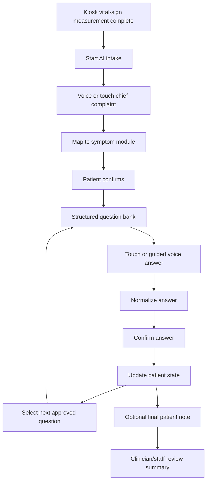

# Meeting Brief - Guided ASR And Structured Intake

Date: 2026-05-15 discussion material draft  
Audience: Prof. Wu, 慧誠智醫, internal collaborators  
Status: shareable after privacy review; no patient data; no production claim

## Executive Position

The recommended ASR direction is:

```text
guided voice + structured questionnaire + confirmation loop
```

not:

```text
open-ended ASR chatbot
```

We can support the company's voice-input goal, but voice should be an input
method for structured intake. The core medical information should remain
single-choice, multiple-choice, yes/no/not-sure, numeric scale, or short
confirmed text.

## Why This Is The Better v0 Direction

The first-principles goal is to help physicians and medical staff receive
usable information before formal diagnosis. The system should reduce repetitive
intake work, not create long free-text transcripts that staff must read and
clean up again.

Open-ended ASR would require a heavy pipeline:

```text
patient free speech
-> ASR
-> sentence cleanup
-> symptom extraction
-> medical term mapping
-> negation and uncertainty handling
-> red-flag interpretation
-> next-question selection
-> clinician summary
```

That pipeline is difficult to validate, vulnerable to ASR errors, and
unfavorable for an older CPU-only kiosk without GPU and without a preferred
cloud LLM dependency.

## Recommended System Role

The system should be positioned as:

> a vital-aware, voice-capable, structured intake workflow that prepares a
> clinician/staff review summary.

It should not be positioned as:

> a free-chat medical AI that diagnoses or decides final triage level.

## ASR Should Be Used In Three Places

| ASR role | Example | Boundary |
| --- | --- | --- |
| Chief complaint entry | "I feel burning when I pee" -> urinary symptom module | Patient confirms before continuing. |
| Fixed answer input | "yes", "three days", "eight out of ten" | Mapped to approved options and confirmed. |
| Final note | "I had this once last year" | Stored as patient note; does not drive v0 triage logic. |

## Proposed Patient Flow



## Practical Trade-Off Table

| Design | Strength | Risk | Recommendation |
| --- | --- | --- | --- |
| Touch-only structured questionnaire | Most stable, easiest to validate, works on low hardware | Less voice-forward | Best v0 fallback |
| Open-ended ASR chatbot | Natural and impressive when it works | Diffuse answers, heavy NLP, ASR errors, harder claims | Not recommended for v0 |
| Guided ASR with structured choices | Voice experience plus structured data and reviewability | Requires option mapping and confirmation UI | Best v1 direction |

## Suggested v0 / v1 Language

Recommended:

> The first version should use structured intake as the clinical backbone.
> Patients may answer by voice, but the answers should be mapped into fixed
> options, confirmed, and then summarized for staff review.

Avoid:

> The patient can freely chat with the AI and the AI will determine the triage
> result.

Recommended:

> ASR is an input interface. The approved question bank and review summary are
> the clinical product surface.

Avoid:

> ASR plus LLM replaces the intake nurse or clinician judgment.

## Proposed Implementation Roadmap

1. Demo v0:
   - English structured intake;
   - touch input first;
   - optional final ASR note;
   - two source-governed flows;
   - clinician/staff review summary.
2. Demo v1:
   - guided voice for chief complaint;
   - voice answers mapped to fixed options;
   - patient confirmation loop;
   - source IDs visible in reviewer/debug view.
3. Demo v2:
   - vital-sign-triggered adaptive question routing;
   - still from approved question bank;
   - no final diagnosis or autonomous triage claim.
4. Product path:
   - clinician tabletop review;
   - retrospective or synthetic-case validation;
   - privacy, cybersecurity, change control, and human factors review.

## Decisions Needed From 慧誠 / Prof. Wu

| Decision | Why it matters |
| --- | --- |
| Is touch-first structured intake acceptable for June v0? | Stabilizes the customer demo. |
| Is guided voice acceptable as the ASR direction instead of open chat? | Aligns voice goal with reviewability. |
| Which device/SKU and CPU profile should be assumed? | Determines local ASR feasibility. |
| Can v0 use synthetic data and mocked iMVS-shaped payloads? | Avoids patient-data and integration risk. |
| Who approves red-flag wording and output summary text? | Prevents accidental clinical claims. |
| Which flows are enough for the first demo? | Keeps scope bounded. |

## Meeting Close Recommendation

Close with this position:

> For the June demo, I recommend structured intake first, with ASR as a guided
> input option. This gives the customer the voice-capable product direction
> they want, while keeping the clinical information structured, traceable,
> reviewable, and feasible on the kiosk hardware.

