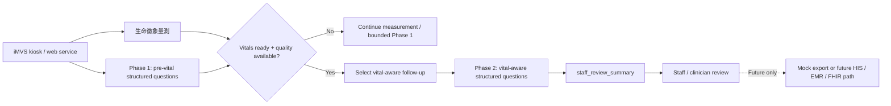

# NYCU 團隊回覆慧誠智醫：iMVS / AI Triage Demo API v0.2 會前閱讀文件

提供對象：慧誠智醫（imedtac Co., Ltd.）/ NYCU 團隊

會議時間：`2026-05-21 10:00` Asia/Taipei

## 1. NYCU 團隊回覆摘要

NYCU 團隊建議六月 AI Triage Demo 直接收斂成一個可整合、可測試、可由工作人員 / 臨床人員檢閱的 synthetic-data vital-aware intake loop：

```text
iMVS 提供合成生命徵象 payload
-> NYCU 團隊回傳結構化 question object 與 session_key
-> iMVS 回傳結構化回答與 session_key
-> NYCU 團隊回傳下一題或 staff_review_summary
-> 工作人員 / 臨床人員檢閱
```

這個切法符合慧誠智醫（imedtac）目前提出的六月 demo 需求：它能把 iMVS 量測資料帶入 AI Triage 流程，能在 kiosk / web service demo 中呈現動態問診能力，也能保留清楚的人員檢閱邊界。

NYCU 團隊建議 5/21 sync 直接確認 API v0.2 的欄位、session 行為、UI 插入點、第一個 respiratory demo case，以及 5/22 前的 owner / date。

## 2. 六月 Demo 系統流程建議

NYCU 團隊建議六月 demo 採用 two-phase workflow：iMVS 量測生命徵象時，先執行不依賴生命徵象數值的 Phase 1 structured questions；生命徵象完成且 quality status 可用後，再進入 Phase 2 vital-aware follow-up，最後產生 `staff_review_summary` 給工作人員 / 臨床人員檢閱。



圖中的 dashed future path 只表示後續產品方向，不屬於六月 critical path。六月 API v0.2 的交付重點是前段 `iMVS payload -> structured questions -> staff_review_summary -> staff / clinician review` 的可測試閉環。

## 3. 六月 Demo 工作範圍

六月主線建議固定為：

- 一個完整的 synthetic respiratory demo case；
- iMVS-shaped vital-sign payload；
- 結構化、選項式、可追蹤的 question object；
- `session_key` 維持一次 demo session；
- `<8` 個可見病人端問題，建議硬性上限為 `7`；
- `staff_review_summary` 作為 staff-only output；
- 穩定 error behavior 與 standard staff workflow fallback；
- demo log、截圖與 payload 均不含真實病人識別資料。

六月版本的邊界控制為：

- output 是 `staff_review_summary`，不是診斷；
- output 供工作人員 / 臨床人員檢閱，不是最終 triage / acuity level；
- 不提供治療建議或 emergency order；
- 不使用真實病人姓名、MRN、身分證字號、電話、raw audio 或 live chart data；
- 不執行 production HIS / EMR / FHIR writeback；
- 對外主張維持 demo capability、human-review boundary 與六月整合工作合約，不主張法規核准或正式臨床分級產品狀態。

這些邊界是六月 demo 的設計控制，讓工程整合、臨床檢閱與對外溝通可以在同一個安全範圍內前進。

## 4. API v0.2 建議合約

NYCU 團隊建議 API v0.2 先使用三個 endpoint。若 imedtac UI 暫時無法支援 two-phase flow，可改走 post-measurement-only fallback。

### Endpoint 1：建立 session

```http
POST /api/triage-demo/sessions
```

用途：

- 建立 demo session；
- 接收 iMVS synthetic vital payload 或 measurement-in-progress 狀態；
- 回傳 `session_key`；
- 回傳第一個可顯示的 question object。

建議 request fields：

- `api_version`
- `schema_version`
- `flow_version`
- `case_id`
- `request_id`
- `idempotency_key`
- `workflow_mode`
- `measurement_state`
- `vitals_ready`
- `client`
- `patient_context`
- `vitals`
- `capabilities`

建議 response fields：

- `session_key`
- `session_expires_at`
- `session_state`
- `last_question_id`
- `status`
- `progress`
- `question`
- `demo_boundary`

### Endpoint 2：送出回答

```http
POST /api/triage-demo/sessions/{session_key}/answers
```

用途：

- iMVS 將使用者回答送回 NYCU；
- NYCU 團隊根據目前 session、回答、生命徵象狀態回傳下一題；
- 若已到 handoff point，回傳 `staff_review_summary`。

建議 request fields：

- `session_key`
- `question_id`
- `answer.selected_option_ids`
- `answer.scale_value`
- `client_event.input_mode`
- `request_id`
- `idempotency_key`

建議 response：

- `status: "question"` 與下一個 `question`；或
- `status: "summary"` 與 `staff_review_summary`。

### Endpoint 3：生命徵象完成後回傳 payload

```http
POST /api/triage-demo/sessions/{session_key}/vitals
```

用途：

- 支援 two-phase flow；
- Phase 1 在 iMVS 量測中先問 non-vital-dependent questions；
- 生命徵象完成後，iMVS 透過此 endpoint 回傳 vitals-ready payload；
- NYCU 團隊再啟動 vital-aware follow-up。

建議優先採用：

```text
parallel_measurement_intake
```

若 imedtac UI 或量測流程不適合在量測中顯示問題，六月可採用：

```text
post_measurement_only
```

## 5. imedtac 需確認的 iMVS Vital Payload

Post-baseline update: imedtac 已在 `2026-05-12` iMVS API `V1.4` 提供
`NBP/SPO2/HR/Temp/Glucose/Height/Weight` 與 sample units。NYCU 團隊可以先依照
這份 baseline 建立 mock adapter 與 API v0.2 examples；imedtac engineering
team 需確認 current demo machine / GitHub 格式是否有 field-name delta、
required / optional 差異，以及 missing / failure semantics。

```json
{
  "vitals": {
    "measurement_timestamp": "2026-05-21T10:00:00+08:00",
    "device_id": "IMVS-DEMO-001",
    "temperature": {
      "value": 38.5,
      "unit": "C",
      "measurement_status": "measured",
      "quality_flag": "needs_review",
      "missing_reason": null
    },
    "spo2": {
      "value": 92,
      "unit": "%",
      "measurement_status": "measured",
      "quality_flag": "needs_review",
      "missing_reason": null
    },
    "heart_rate": {
      "value": 102,
      "unit": "bpm",
      "measurement_status": "measured",
      "quality_flag": "ok",
      "missing_reason": null
    },
    "respiratory_rate": {
      "value": 23,
      "unit": "breaths/min",
      "measurement_status": "manual_entry",
      "quality_flag": "needs_review",
      "missing_reason": null
    },
    "blood_pressure_systolic": {
      "value": 123,
      "unit": "mmHg",
      "measurement_status": "measured",
      "quality_flag": "ok",
      "missing_reason": null
    },
    "blood_pressure_diastolic": {
      "value": 81,
      "unit": "mmHg",
      "measurement_status": "measured",
      "quality_flag": "ok",
      "missing_reason": null
    }
  }
}
```

5/21 sync 建議確認：

- current iMVS field names 是否沿用 5/12 V1.4 baseline；
- 若每個 vital field 的 unit 與 V1.4 baseline 不同，請提供 current unit；
- 哪些欄位是 guaranteed，哪些欄位是 optional；
- measurement failure、missing value、poor-quality measurement 如何表示；
- 是否能使用 per-vital `measurement_status`、`quality_flag`、`missing_reason`；
- 若六月來不及 per-vital quality fields，是否使用 session-level quality fields。

## 6. 第一個 Demo Case 建議

NYCU 團隊建議第一個 case 採用：

```text
呼吸喘、發燒與較低血氧的 synthetic respiratory case
```

合成設定：

- 年齡：`80`
- 性別：`male`
- 體溫：`38.5 C`
- SpO2：`92%`
- 心率：`102 bpm`
- 呼吸速率：`23 breaths/min`
- 血壓：`123/81 mmHg`

這個案例適合作為第一個 demo case，因為它可以清楚呈現 iMVS 量測資料如何影響後續問題，也能自然收斂為 staff-review handoff，而不需要輸出診斷、治療建議或最終檢傷分級。

建議問題流程：

| # | 階段 | 問題目的 | 類型 |
| --- | --- | --- | --- |
| 1 | pre-vital intake | 主訴 | single-choice |
| 2 | pre-vital intake | 呼吸喘持續時間 | single-choice |
| 3 | pre-vital intake | 呼吸不適嚴重程度 | scale 或 single-choice |
| 4 | pre-vital intake | 相關症狀 | multi-choice |
| 5 | post-vital follow-up | 胸痛或胸口壓迫感確認 | single-choice |
| 6 | post-vital follow-up | 慢性肺病、居家氧氣或呼吸用藥脈絡 | multi-choice |
| 7 | post-vital follow-up | 藥物過敏或需 staff 確認的用藥脈絡 | multi-choice |

5/21 sync 需要許醫師確認：

- respiratory case 是否作為第一個 live demo case；
- 哪些回答或 vital pattern 應觸發 early handoff；
- `staff_review_summary` 的安全 wording；
- customer demo 中不得出現的 wording。

## 7. Staff-Review Summary 建議格式

NYCU 團隊建議 summary 欄位固定為：

```json
"staff_review_summary"
```

建議 response shape：

```json
{
  "status": "summary",
  "summary_visibility": "staff_only",
  "handoff_required": true,
  "handoff_reason_codes": [
    "reported_shortness_of_breath",
    "measured_lower_oxygen_saturation_demo",
    "measured_fever_demo"
  ],
  "staff_review_summary": {
    "format": "review_summary_demo",
    "subjective": [
      "合成案例：使用者回報呼吸喘。"
    ],
    "objective": [
      "合成量測生命徵象包含發燒、呼吸速率偏高，以及本 demo 情境中較低的血氧值。"
    ],
    "review_basis": [
      "回報的呼吸症狀與量測血氧線索應由工作人員檢閱。"
    ],
    "review_action": [
      "需要工作人員或臨床人員檢閱。"
    ],
    "staff_handoff_note": "請檢閱量測生命徵象與使用者回報症狀。",
    "not_claimed": [
      "本 demo 不提供診斷。",
      "本 demo 不提供治療建議。",
      "本 demo 不指定最終檢傷分級。",
      "本 demo 不寫入 HIS/EMR/FHIR。"
    ]
  }
}
```

NYCU 團隊建議使用 `review_basis`、`review_action`、`staff_handoff_note`。欄位命名應避開會被理解成診斷、SOAP Assessment 或 SOAP Plan 的語意。

## 8. Error Behavior 與 Fallback

若 API、session、measurement quality 或 network 失敗，系統應回到標準 staff workflow，不產生假的臨床摘要。

建議 fallback 文字：

```text
AI Triage Demo service 目前無法使用，或 measurement quality 無法支援本次 demo 摘要。請繼續使用標準工作流程。本次未產生 AI 產生的臨床摘要。
```

建議 error fields：

- `status: "error"`
- `error.code`
- `error.message`
- `http_status`
- `retry_allowed`
- `fallback_to_standard_staff_workflow: true`

Error response 不包含 `staff_review_summary`。

## 9. Voice 與 HIS / FHIR Writeback 建議

NYCU 團隊建議六月 critical path 先不納入 voice input 與 production HIS / EMR / FHIR writeback。

Voice input 可以列為後續延伸項目。若要做 voice，建議最低條件為：

```text
voice -> transcript -> user confirmation -> structured choice answer
```

六月 demo 不保留 raw audio，不讓語音直接產生 summary。

HIS / EMR / FHIR writeback 建議維持 future-state 或 mock export。六月版本可以做 staff / clinician review page，但不連接 production endpoint，也不把 demo output 寫回真實病歷系統。

## 10. 5/21 Sync 建議收斂事項

| Owner | 交付項目 | 建議期限 | 驗收方式 |
| --- | --- | --- | --- |
| imedtac | Synthetic iMVS vital payload example 與 current field-dictionary delta |  | 確認是否沿用 5/12 V1.4 欄位與 units，並明確化 required / optional、missing / failure behavior。 |
| imedtac | UI insertion decision |  | 明確指定 same-app、iframe、external link、backend API、laptop API 或 static mock。 |
| imedtac | Two-phase feasibility decision |  | 確認 Phase 1 during measurement 與 vitals-ready endpoint 是否可行。 |
| imedtac | demo 日期、受眾、成功標準、engineering POC |  | 明確指定日期、受眾、預期證明項目與單一 owner。 |
| 許醫師 / NYCU 團隊| Respiratory case stop rule 與 safe summary wording |  | 核准第一個案例、handoff trigger 與確切 wording boundary。 |
| Jason / NYCU 團隊| 欄位確認後的 confirmed API v0.2 |  | 依 field dictionary、session ownership 與 error behavior 更新草稿。 |
| Jason / NYCU 團隊| One respiratory mock adapter / static rehearsal |  | 一個合成案例可跑完 request -> answer -> summary examples。 |
| 隱私 / 資安 owner | Demo data 與 endpoint boundary |  | 確認 synthetic-only data、no raw audio、no production endpoint 與 log policy。 |

## 11. NYCU 團隊建議寄送文字

主旨：

```text
AI Triage Demo：NYCU 團隊回覆 iMVS / API v0.2 會前閱讀文件
```

內文：

```text
Johnny 與 imedtac engineering team 您好，

NYCU 團隊端先整理本次 iMVS / AI Triage Demo API v0.2 的會前閱讀文件，供 5/21 sync 直接收斂工程與臨床 review 決策。

NYCU 團隊建議六月 demo 固定成一個 synthetic-data vital-aware intake loop：iMVS 提供合成生命徵象 payload，NYCU 團隊回傳結構化 question object 與 session_key，iMVS 回傳結構化回答，NYCU 團隊最後回傳 staff_review_summary 給工作人員 / 臨床人員檢閱。

這份文件包含 API v0.2 建議合約、vital payload 欄位方向、第一個 respiratory demo case、staff_review_summary 格式、error fallback，以及 5/21 sync 建議收斂的 owner / date。

明天會議建議優先確認：
- current iMVS field-dictionary delta from the 5/12 V1.4 baseline；
- UI insertion point；
- session_key ownership；
- Phase 1 during measurement 是否可行；
- first respiratory case 與 safe summary wording；
- confirmed API v0.2 的交付時間。

Jason 敬上
```

## 12. 建議附檔

建議一併提供：

- 本文件；
- `2026-05-21-imvs-nycu-api-design-v0.2-draft.md`；
- `api-examples/` JSON examples；
- `2026-05-21-decision-defaults-and-owner-matrix.md`。

若 5/21 會前只寄一份文件，建議寄送本文件，並於會中或會後補上 API examples。
