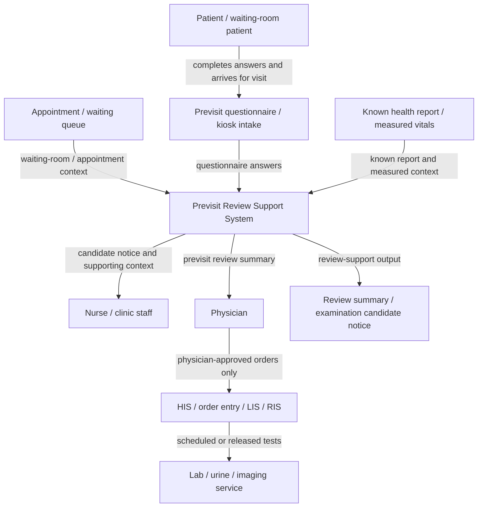

# 專利提案揭露書草稿 - AI Triage

Status: `draft-ready for Tomi review; must be transferred into Tomi / 德米專用範本 docx before formal submission`

Template basis:
`/home/jnln3799/record_jn/record_audio_ubuntu/260309_0904_lab_sync_(patent_Tomi)/260310_專利撰寫/專利提案揭露書-德米專用範本.docx`

Draft date: `2026-05-18`

Source basis:

- `source/2026-05-13-duobao-line-imedtac-vital-sign-triage/source.md`
- `source/2026-05-15-imedtac-second-sync-and-duobao-followup/meeting-record.md`
- `source/2026-05-21-wu-line-ai-triage-patent-protection/line-thread.md`
- `source/2026-05-21-wu-line-ai-triage-patent-protection/thinking-and-schedule.md`
- `source/2026-05-21-wu-ai-triage-ip-and-career-call/meeting-record.md`
- `source/2026-05-21-wu-ai-triage-ip-and-career-call/thinking-and-schedule.md`
- `docs/architecture-insertion-and-clinical-grounding.md`
- `handoff/2026-05-15-june-demo-case-pack-v0.md`
- `handoff/reviewer-packet/claim-language-control.md`
- Public-source product / patent check on `2026-06-21`; see the public evidence
  snapshot in this draft.

Disclosure boundary:

- This is a patent-disclosure drafting packet, not a legal filing.
- This is not a clinical protocol, regulatory submission, FDA/TFDA claim, or production clinical-triage claim.
- Hidden implementation details such as exact scoring formulas, model weights, prompt chains, embedding configuration, threshold constants, source-ranking weights, and data curation logic should remain trade secret unless Tomi / counsel asks for controlled disclosure.
- Future patent-related architecture figures should stop at `Level 1: System Context Diagram`. Do not include C4 Level 2 container diagrams, Level 3 component diagrams, class/code diagrams, model pipelines, routing formulas, prompt chains, threshold tables, database placement, or deployment topology unless Tomi / counsel explicitly asks for controlled disclosure.

## 2026-05-21 Prof. Wu Protection Signal

Prof. Wu's post-meeting LINE instruction changes the handling priority of this
draft:

```text
我們和慧誠合作要有自己專利先保護自己
```

Working interpretation:

- This draft is now a cooperation-protection gate, not only a technical
  write-up.
- Jason should discuss the AI-Triage patent direction with Prof. Wu and Tomi
  before teaching imedtac the full reusable method.
- API-level integration details can still move forward for the June demo.
- Patent-sensitive details should stay internal until Prof. Wu / Tomi decide
  what becomes a patent claim and what stays trade secret.
- The follow-up phone call at `2026-05-21 12:05` further clarifies that lab API
  mode is both a demo path and a know-how boundary, and that meeting records
  should attribute which ideas came from Jason / 多寶 / NYCU versus imedtac.

Pre-handoff disclosure rule:

```text
Share the API contract and safe demo boundary.
Do not share the full reusable routing / source-governance / claim structure
until the internal patent-protection path is clear.
```

## 2026-06-19 / 2026-06-21 Tomi Drafting Update

The `2026-06-19` Prof. Wu / Tomi / 多寶 / Jason discussion reframes this
disclosure from generic kiosk intake into a previsit / waiting-room examination
readiness workflow:

```text
completed questionnaire + known health report / measured data
-> identify patients who may benefit from earlier clinician review
-> notify or queue a physician / nurse review target
-> physician decides whether to order blood test, urinalysis, imaging, or other
   pre-visit examination
-> patient can complete the examination path before the ordinary called-into-room
   visit step when the physician approves
```

This is the positive claim center for the next patent draft:

```text
The system converts already-available previsit information into a human-review
workflow that helps clinicians notice examination candidates before the ordinary
visit sequence wastes patient and staff time.
```

The claim should lead from this point:

```text
other products and older patent examples collect or organize previsit intake;
this proposal focuses on the next operational gap:
using completed questionnaires / known reports / measured context to surface
waiting patients who may merit physician-approved pre-visit orders.
```

Use the Tomi-derived drafting posture from the earlier patent packets:

- Claim the observable workflow: source signal -> trigger / state transition ->
  visible review queue or notification -> clinician-controlled service action ->
  output record.
- Keep hidden implementation protected: model architecture, prompts, scoring,
  embeddings, threshold constants, source-ranking logic, routing weights,
  database layout, deployment topology, and institution-specific know-how.
- Write the patent figure at `Level 1: System Context Diagram` only. The figure
  should show people, external systems, and the proposed system boundary; it
  should not decompose the proposed system into adapters, routers, model
  services, registries, containers, or code modules.
- Frame the system as review-support and workflow-acceleration. The system
  presents candidates and context; the physician remains the actor who decides
  whether to open an order.

### Product-Cooperation Questions To Carry Into Tomi Review

The current MOU is too general for product co-development. Before deeper
implementation transfer, prepare questions around:

- development responsibility: which part is imedtac's device / UI / gateway,
  and which part is NYCU's AI workflow / source-governed question logic;
- overlap: how joint discussion ideas are recorded and attributed;
- revenue / license logic: whether imedtac licenses the workflow, pays per
  product / site / module, or uses another arrangement;
- trade-secret split: what belongs in patent claims versus internal know-how;
- meeting-record evidence: what documents show Jason / 多寶 / NYCU idea origin;
- timing: whether a filing / internal invention disclosure is needed before the
  next detailed imedtac technical handoff.

## 專利提案名稱

候診病人前置問診資訊之醫師審閱導引與檢查需求提示系統及方法

Alternative English working title:

System and Method for Pre-Visit Review Guidance and Examination-Candidate Notification for Waiting-Room Patients

Related earlier working title:

基於量測生理訊號之動態問診與臨床審閱摘要產生系統及方法

## 一、是否需進行專利檢索或專利探勘?

1. □需進行專利檢索  ■需進行專利探勘  □無須進行，直接申請
2. □公司內部自行處理  ■委外處理
3. □已進行專利檢索  □已進行專利探勘  ■尚未完成正式前案檢索

### 目前已知參考 / 待探勘方向

| 相關專利前案 / 文獻國別 | 申請案號或期刊資訊 | 備註 |
| --- | --- | --- |
| US / FDA public material | 510(k) comparable-product summaries to be identified | 用於界定 intended use、software risk、clinical decision support 邊界；不作為症狀問診規則來源。 |
| Emergency medicine / triage literature | ESI / emergency triage source family to verify | 用於理解 urgent-care / emergency-style triage support 的工作流與 clinician-review 邊界。 |
| Clinical guideline families | AHA / ACC, CDC, ADA, AUA / EAU, local hospital protocol to verify | 用於後續 question provenance；本揭露書不直接主張已完成臨床驗證。 |
| Existing symptom-checker / triage systems | To be searched by Tomi / patent office | 需探勘是否已有 symptom checker, vital sign triage, kiosk intake, clinician summary, dynamic questionnaire patents. |
| Company kiosk / iMVS material | 慧誠智醫 product / API materials | 本提案插入於量測後 workflow；公司既有硬體 / gateway / API 屬合作背景，不直接主張為本發明核心。 |

### 2026-06-21 Public Product / Patent Evidence Snapshot

This is not a formal freedom-to-operate search. It is a drafting-control scan to
keep the Tomi review packet claim-centered and source-aware.

| Evidence type | Public source checked | Drafting reading |
| --- | --- | --- |
| Digital intake product | Phreesia electronic intake forms: `https://www.phreesia.com/electronic-intake-forms/` | Product positioning centers on collecting patient information, signatures, registration, PM/EHR integration, and front-desk efficiency before or during arrival. |
| EHR / check-in product | Epic Welcome app listing: `https://apps.apple.com/us/app/epic-welcome/id1369984917` | Public product surface emphasizes self-service at the start of care, questionnaires, and e-signature. |
| Check-in product | eClinicalWorks healow CHECK-IN: `https://www.eclinicalworks.com/products-services/patient-engagement/check-in/` | Public product surface emphasizes pre-appointment reminder, demographics, insurance, consent, questionnaires, medications, allergies, and arrival notification. |
| Digital intake product | Kyruus Health Check-In: `https://kyruushealth.com/solutions/check-in/` | Public product surface emphasizes remote pre-visit check-in, demographics, clinicals, consent forms, insurance, payments, EHR sync, and lower in-office wait. |
| Digital forms product | NexHealth Forms: `https://www.nexhealth.com/features/forms` | Public product surface emphasizes online forms, EHR sync, form logic, and staff alerts for submitted medical information. |
| AI intake product | Infermedica Intake: `https://infermedica.com/solutions/intake` | Public product surface emphasizes automated collection and organization of essential health data before consultations. |
| Dynamic questionnaire patent | `US20020035486A1`, computerized clinical questionnaire: `https://patents.google.com/patent/US20020035486A1/en` | Prior art covers response-dependent medical questions and clinical warnings; avoid claiming generic dynamic questionnaire novelty. |
| Patient-history / physician-report patent | `US20080177578A1`, patient information processing and evaluation: `https://patents.google.com/patent/US20080177578A1/en` | Prior art includes physician-facing reports before the physician sees the patient and mentions physician links to order selected lab tests; avoid claiming the broad idea of "history report plus lab tests" as new by itself. |
| CDS patent | `US20120232930A1`, clinical decision support: `https://patents.google.com/patent/US20120232930A1/en` | Prior art covers recommending diagnostic / therapeutic steps from similar EHR records; avoid claiming generic CDS recommendation of diagnostic actions. |
| Clinical workflow reference | AMA STEPS Forward pre-visit laboratory testing: `https://edhub.ama-assn.org/steps-forward/module/2833567` | Pre-visit lab testing is a known workflow improvement; the invention should focus on how completed intake/report context surfaces candidates inside a waiting-room or pre-visit queue for physician-approved ordering. |
| Clinical workflow reference | AAFP pre-visit planning: `https://www.aafp.org/fpm/2015/1100/p34` | Pre-visit questionnaires and pre-visit labs are known practice concepts; the patent draft should emphasize the operational bridge between completed intake data and timely physician order review. |
| Order-control boundary | CMS lab test order requirements: `https://www.cms.gov/lab-test-order-requirements` and Noridian physician order guidance: `https://med.noridianmedicare.com/web/jeb/specialties/lab/physicians-orders-for-diagnostic-laboratory-tests` | Keep the system as examination-candidate notification / order-readiness support. Physician intent and order documentation remain the controlled clinical action. |

Drafting implication:

```text
Do not frame novelty as "previsit questionnaire" or "AI recommends tests."
Frame the invention as:
completed intake / known report / measured context
-> waiting-patient examination-candidate signal
-> physician / nurse previsit review surface
-> physician-approved order path
-> reduced wasted waiting and repeated post-call examination loops.
```

## 二、請描述與本提案相關之習知作法(傳統作法 / 傳統技術)?

### 1. 一般症狀問診系統多以文字或固定題目為主

傳統 symptom checker 或線上問診工具，多以患者主訴、文字輸入、固定選項或單一路徑決策樹來收集資料。此類系統常先問「哪裡不舒服」、「症狀多久」、「是否疼痛」等固定問題，再輸出建議或摘要。

此類作法的問題是，問診流程通常未能即時利用 kiosk 或醫療量測設備取得的血壓、血氧、體溫、心率、身高、體重等客觀量測資料。即使患者的生理訊號已經被量測，傳統問診流程仍可能依照固定順序詢問，而不是依生理訊號改變下一題優先順序或摘要重點。

### 2. 醫療量測 kiosk 多以量測與報告為核心

既有 vital-sign kiosk 或自助量測設備，常見流程為：

```text
患者登入 / 識別
-> 量測血壓、血氧、體溫、身高、體重等
-> 顯示量測結果或產生報告
-> 可能透過 API / gateway / FHIR / HIS / EMR 路徑傳送資料
```

這類設備的強項是硬體整合、量測流程、gateway / middleware、醫院系統串接與報告輸出。然而，量測結果通常只是被展示或傳送，未必進一步驅動問診流程，也未必形成可被 nurse / clinician 快速審閱的動態摘要。

### 3. AI chatbot 類醫療問答容易形成黑箱與過度主張

部分 AI 問診或 chatbot 系統強調自然語言對話，但若缺乏可追溯的臨床來源、問題來源、觸發條件與人工審閱邊界，容易形成黑箱式醫療判斷。此類系統若直接輸出診斷、治療建議、final triage level 或 emergency referral，會產生臨床安全、法規、責任歸屬與使用者誤信風險。

### 4. 線性問卷難以處理生理訊號與症狀的組合情境

傳統固定問卷常假設所有患者都走相似題目順序。然而，多寶醫師的臨床討論指出，vital signs 對 urgent-care / emergency-style intake 最有價值，因為生理不穩定與患者主訴的組合會影響醫護人員需要先知道什麼。

例如：

- 發燒加血氧偏低時，呼吸症狀與胸痛相關問題應更優先；
- 胸悶加心率很快時，應更快形成 staff-review 摘要，而不是繼續完整低風險問卷；
- 泌尿症狀加發燒或 flank pain 時，可能需要從單純症狀收集轉向 clinician review context。

傳統固定題目較難把這種「生理訊號 + 主訴 + 回答狀態」的組合轉成動態問診流程。

### 5. 公開產品多停在 intake / check-in / questionnaire 服務面

公開可查的商品資料顯示，現有主流產品多以數位表單、報到、問卷、保險 / 同意書、病史資料收集、EHR 同步、付款、到院通知或 clinician-before-consultation 資料整理為主要價值。這些服務能降低櫃台與資料輸入負擔，也能讓醫師在看診前取得較完整資料。

本提案承接這些已知價值，但把 claim 重點放在下一段 workflow gap：病人已在候診前完成問卷、已有健康報告或量測資料後，系統如何把這些資訊轉成「哪些候診病人值得醫師提前審閱、是否可能先開立檢查單」的候選提示。

### 6. 前案已觸及 physician report / lab order link / CDS recommendation

公開專利檢索也顯示，不能把 broad "medical questionnaire"、"physician-facing report"、"lab test link" 或 "clinical decision support recommendation" 當成完全未見的新概念。至少 `US20080177578A1` 已描述給醫師的報告以及讓醫師接受、修改或拒絕系統選出的 lab-test order entry；`US20120232930A1` 也涵蓋根據相似電子病歷提出 diagnostic / therapeutic steps。

因此，本提案的 claim 控制應更精準：不是自動診斷或自動開單，也不是單純問卷，而是將完成的前置問診 / 健康報告 / 量測資訊連接到候診隊列中的 physician-approved examination readiness workflow。

## 三、請描述習知作法的缺點或問題(亦即本提案所欲解決問題)?

### 1. 生理訊號未能成為問診流程的即時觸發條件

現有 kiosk 能量測生命徵象，但多數流程只是顯示或保存結果。量測結果未必用於即時決定下一題、優先詢問的症狀、是否應縮短問診、或摘要中應突出哪些 review signals。

### 2. 固定問卷與通用 chatbot 缺乏可審計的臨床工作流

固定問卷缺乏彈性；通用 chatbot 又可能缺乏可審計性。本提案要解決的是如何在兩者之間建立一個 source-governed、clinician-review 的工作流，使系統能依已知資料提示下一步審閱需求，但仍可解釋、可控、可審閱。

### 3. 全科別 AI triage 容易過度擴張

公司需求曾提到 all-specialty AI triage，但多寶與既有討論顯示，vital signs 對不同科別的意義不同。若直接主張全科別完成，會導致臨床規則、資料來源、驗證與責任邊界全面失控。

因此，本提案要解決的是：如何用共用前置問診、量測資料、題目來源治理與審閱摘要工作流建立可擴充架構，而不是一次主張已完成全科別臨床決策。

### 4. 直接輸出診斷或最終分級會造成安全與法規風險

若 AI 系統直接給出診斷、治療、final triage level、急診轉送或用藥建議，會超出目前 demo 與臨床驗證範圍。本提案需要把 output 限制在 clinician-review summary / staff-review summary，讓最終決策保留給人類醫護。

### 5. 候診流程未充分利用已完成問卷與既有健康報告

傳統門診流程常在病人完成報到、問卷、生命徵象量測或既有健康報告上傳後，仍等到正式叫號進診間時，醫師才第一次整合病情與資料。若醫師此時才判斷需要抽血、驗尿、X-ray、超音波或其他檢查，病人會重新進入等待流程，醫護也需要重複收集與解釋資料。

本提案要改善的是候診期間的資訊利用方式：將已完成問卷、已知健康報告、量測資訊與科別 watch items 轉成可被醫護提前審閱的工作流訊號，使醫師能在正式看診前判斷是否需要先安排檢查或由護理人員補充必要資訊。

## 四、針對習知作法之缺點或問題，本提案做了哪些改善或改變?

本提案提出一種「候診病人前置問診資訊之醫師審閱導引與檢查需求提示系統及方法」。其核心不是讓 AI 直接診斷，也不是自動開立檢查單，而是將已完成問卷、既有健康報告、kiosk 量測資料與科別 watch items 轉成可觸發、可追溯、可由醫師審閱的候診前檢查候選提示工作流。

### 1. 量測後插入 AI-assisted intake workflow

系統插入點設定在 vital-sign measurement 完成後：

```text
患者登入 / 啟動 kiosk
-> 固定基本問題可先開始
-> 量測血壓、血氧、體溫、身高、體重、心率等
-> 將量測資料與患者主訴 / 回答合併
-> 啟動前置審閱支援工作流
-> 產生 clinician-review summary
```

此設計保留 kiosk 原本量測與 API / gateway 價值，同時讓生理訊號不只是報告欄位，而是可影響後續問診流程的 workflow signal。

### 2. 量測資訊成為問診觸發上下文

系統在 Level 1 工作流中接收量測值，並把量測值作為下一步問診與醫護審閱提示的上下文。該工作流不直接輸出診斷，而是支持下列審閱需求：

- 哪些問題應優先；
- 哪些 red-flag family 應被提示給 staff review；
- 是否應縮短低風險問卷；
- 摘要中哪些客觀量測與主觀症狀應被並列呈現；
- 哪些問題需要臨床來源或醫師確認後才能啟用。

### 3. 依情境選擇下一步互動，而不是黑箱生成決策

系統依照下列 Level 1 輸入脈絡，選擇下一個應詢問或應提示醫護審閱的問題：

- 患者主訴；
- 量測生理訊號；
- 已回答題目；
- 缺失資訊；
- clinical source / provenance 狀態；
- demo-only safety boundary；

此處可用多種可審計方法實作，但專利揭露不綁定特定模型、權重、排序方法或內部路由。

### 4. 題目來源與 question provenance 控制題目使用

每個 production-facing 問題未來應對應：

- question ID；
- symptom context；
- vital trigger；
- source family / source name；
- source version；
- clinical purpose；
- escalation effect；
- reviewer owner；
- status。

此設計讓系統的問診問題不是通用 chatbot 自由發揮，而是逐步建立可追溯的醫療工作流。

### 5. Clinician-review summary / examination-candidate notice 取代 autonomous triage decision

系統輸出不是診斷、最終分級或自動檢查單，而是給 nurse / clinician / staff review 的摘要與候選提示，例如：

- 患者主訴；
- 量測到的生命徵象；
- 關鍵陽性 / 陰性回答；
- 是否存在需要 staff review 的訊號；
- 是否存在可由醫師提前審閱的檢查候選，例如抽血、驗尿、X-ray、超音波；
- 本系統未做診斷、治療、用藥、自動開單或 final triage level。

### 6. 模組化科別擴充

系統可由 shared intake core 擴充到不同 specialty modules：

- respiratory / fever module；
- chest discomfort / cardiovascular concern module；
- abdominal pain / fever module；
- urinary symptom module；
- chronic disease / metabolic context module；
- allergy / mild trauma module。

每個 module 都需來源治理與 clinician review，不主張一次完成全科別臨床驗證。

### 7. 候診前檢查需求提示與醫師審閱

本提案可延伸為候診病人的前置審閱支援系統。系統接收病人已完成的門診前問卷、已知健康報告、生命徵象或其他檢查前資訊後，將符合科別 watch items 或檢查需求候選條件的病人放入醫護審閱佇列。

系統輸出不是自動開立檢查單，而是給醫師 / 護理人員的 review-support signal，例如：

- 哪位候診病人已有足夠資訊值得提前審閱；
- 哪些問卷回答或健康報告欄位支持提前審閱；
- 哪些檢查類型可供醫師評估是否需要先開立，例如抽血、驗尿、X-ray、超音波；
- 哪些資訊仍需由護理人員補問或由醫師確認。

醫師若認為合適，再透過既有 HIS / order entry / LIS / RIS 流程開立檢查單。此設計的 workflow value 是縮短無意義候診、減少病人被叫號後才開始排檢查的時間浪費，並提升醫護對候診隊列的前置掌握。

## 五、請描述藉由本提案之技術思維，可以達到何種目的或功效?

### 1. 讓 kiosk 量測資料成為 AI-assisted workflow 的驅動訊號

本提案使血壓、血氧、體溫、心率、身高、體重等量測資料，不只是靜態報告，而能進一步影響問診題目、摘要重點與 staff-review signal，提升 kiosk 由「量測設備」延伸為「AI-assisted intake workflow」的產品價值。

### 2. 降低問診冗餘並提高臨床摘要可讀性

系統可依據已知主訴與量測訊號選擇較有價值的下一題，避免所有患者都走完整固定問卷。最後產生的摘要能協助醫護快速看到：

- 為何患者來；
- 客觀量測是什麼；
- 重要症狀回答是什麼；
- 哪些資訊仍需人工確認。

### 3. 保持安全與責任邊界

本提案將輸出限制在 clinician-review / staff-review summary，而非 autonomous diagnosis 或 final triage level，降低使用者誤信、過度醫療主張與法規風險。

### 4. 提供可擴充的 all-specialty-capable architecture

本提案不是一次完成所有科別規則，而是提供前置問診、量測資料納入、題目來源治理、醫護審閱摘要與科別 watch items 的可擴充工作流。未來可依照臨床來源與 reviewer owner 增加 specialty modules。

### 5. 形成可專利化的 workflow / interaction innovation

本提案的可 claim 重點不是 LLM、ASR、embedding、特定模型本身，也不是泛稱「門診前問診」。主軸是：

```text
完成問卷 / 已知健康報告 / 量測上下文
-> 形成候診病人審閱候選
-> 在醫師叫號前提示醫護人員
-> 醫師決定是否提前開立檢查單
-> 病人先完成檢查或帶著更完整資料進入看診
-> 保留醫師最終診療與開單決策
```

此 workflow 具有 UI / interaction / service orchestration 層面的可觀察性，並直接對應病人與醫護共同面臨的時間浪費問題，因此較適合作為專利揭露主軸。

## 六、請具體說明本提案之實施範例並配合圖示說明(附件)!

Patent-figure rule: this draft should include only the Level 1 system context.
Lower-level container/component/code diagrams remain internal engineering or
trade-secret material unless Tomi / counsel requests controlled disclosure.

### 實施例 1：發燒 + 咳嗽 / 呼吸不適

輸入：

- 主訴：發燒與咳嗽；
- 生理訊號：體溫偏高、SpO2 較低、心率偏快；
- 互動方式：touch choice + optional short voice supplement。

系統流程：

1. 患者完成 kiosk 基本啟動與量測。
2. 系統接收 vital payload。
3. 系統依主訴與 vital context 優先詢問呼吸、胸痛、慢性病、過敏等短問題。
4. 系統停止在 clinician-review summary，不輸出肺炎、COVID、流感等診斷。

輸出摘要示意：

```text
Synthetic demo case.
Patient reports fever and cough.
Measured vitals include elevated temperature and lower SpO2 than expected.
Patient reports / denies shortness of breath and chest pain according to answers.
Staff should review the respiratory complaint and measured vitals.
This demo does not diagnose, recommend treatment, or assign final triage level.
```

### 實施例 2：胸悶 / 心悸 + 心率很快

輸入：

- 主訴：胸悶或心悸；
- 生理訊號：心率很快，可能搭配血壓或 SpO2 context；
- 互動方式：choice-based red-flag questions。

系統流程：

1. 系統識別胸部不適與心率訊號同時存在。
2. 系統優先詢問呼吸困難、頭暈 / 昏厥、起始時間、用藥與慢性病。
3. 若回答與 vital context 顯示需要 review，系統縮短問卷並產生 staff-review summary。
4. 系統不診斷 arrhythmia，不自動指派急診分級。

### 實施例 3：腹痛 + 發燒

輸入：

- 主訴：腹痛；
- 生理訊號：體溫偏高、心率 context；
- 回答：疼痛位置、疼痛程度、嘔吐、慢性病、過敏。

系統流程：

1. 系統依疼痛位置與發燒 context 選擇 location / severity / vomiting / duration 等題目。
2. 系統產生 abdominal pain + fever clinician-review summary。
3. 系統不診斷 appendicitis、cholecystitis 或其他疾病。

### 實施例 4：候診前問診與提前檢查審閱

輸入：

- 病人已完成門診前問卷；
- 系統已取得既有健康報告、生命徵象或上次檢查摘要；
- 科別已設定 watch items，例如可能需要抽血、驗尿、X-ray、超音波或其他檢查前置判斷的條件。

系統流程：

1. 系統將已完成問卷與既有報告整理成候診前審閱摘要。
2. 系統將符合科別 watch items 的病人標示為提前審閱候選。
3. 護理人員或醫師看到候選提示與支持資訊。
4. 醫師判斷是否先開立抽血、驗尿、X-ray、超音波或其他檢查。
5. 病人可在正式叫號前完成部分檢查流程，或在看診時帶著更完整資料進入醫師判斷。

### 圖 1：Level 1 System Context Diagram



Level 1 scope note:

- The diagram shows the proposed system boundary, users, and external systems.
- It intentionally does not show internal routers, model services, scoring,
  database layout, prompts, threshold logic, or deployment architecture.
- The system supports physician review; it does not independently open orders,
  diagnose, prescribe, or assign final triage level.

## 七、建議本提案必要之申請國家

□台灣、□大陸、■美國、□歐洲、□日本、□其他

Recommendation:

- Primary: US, because 慧誠's June demo and business story mention US urgent-care / Texas deployment context.
- Secondary: Taiwan, if the team wants local ownership and a defensive filing before broader collaboration.
- Defer Europe / Japan until commercial path and prior-art search become clearer.

## 八、請相關人員確認並簽名(請按提案貢獻度順序)

| 發明人姓名 | 角色 / 貢獻 | 簽名 | 日期 |
| --- | --- | --- | --- |
| Jason Lin | workflow framing, question provenance / review-support disclosure drafting |  |  |
| 許桓瑜（多寶 / 許醫師） | clinical calibration, urgent-care / emergency-style vital-sign workflow insight, demo case direction |  |  |
| 吳育德老師 | project direction, stakeholder routing, product / regulatory framing |  |  |
| 慧誠智醫相關人員 | kiosk workflow, device/API context, integration constraints, if confirmed as inventor / assignee contributor |  |  |

Note:

- Inventorship and ownership must be reviewed by Tomi / counsel.
- Company-side contribution, contract rights, university rights, and collaboration documents must be checked before filing.

## 附件：待 Tomi / 專利事務所確認事項

1. 是否以一篇主案處理，或拆成：
   - vital-sign-triggered dynamic questioning;
   - clinician-review summary generation;
   - source-governed question provenance / safety boundary。
2. 是否應避免 `triage` 字眼，改用 `intake support` / `clinical review support` 以降低醫療主張風險。
3. 哪些內容應列為 trade secret：
   - exact question-ranking weights;
   - prompt / LLM chain;
   - embedding model choice;
   - question-source scoring;
   - proprietary clinical case curation;
   - company API / integration details;
   - any C4 Level 2 / Level 3 / Level 4 architecture beyond the Level 1 system context。
4. 是否需要先做 patent search / patent mining before filing。
5. formal disclosure 是否只保留 Level 1 system context figure，並把更細架構圖留在 internal engineering / trade-secret packet。
