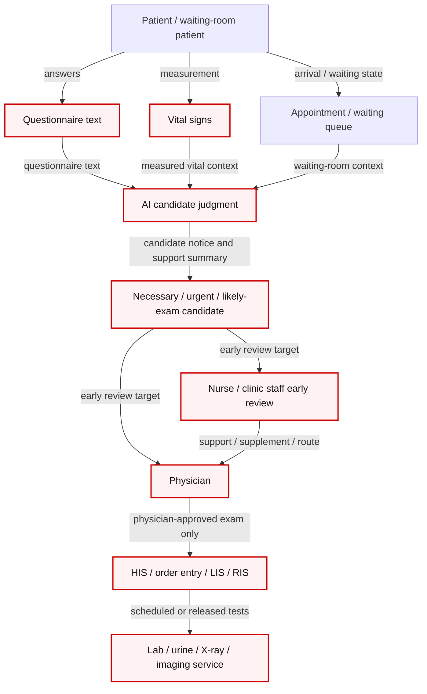

# 專利提案揭露書 v2 - 生命徵象與問卷文字驅動之候診檢查候選審閱系統及方法

本文件整理為可交由 Tomi、專利工程師或專利事務所進一步審閱與轉寫之發明揭露書 v2。本文以 2026-06-22 吳育德老師 / Tomi / Jason 晨會後的 claim 收斂為主軸，將申請重點放在紅框工作流：

```text
生命徵象 + 問卷文字
-> AI 判斷必要、緊急或高度可能需檢查之候診病人
-> 將候選病人送至醫師 / 護理師提前審閱
-> 醫師核准檢查
-> 銜接 LIS / RIS / 檢驗 / 影像等既有檢查流程
```

本 v2 不主張整個門診系統、整個智慧健康艙、一般問卷平台、一般 AI 問診、一般 clinical alert 或自動開單。完整系統流程圖僅作背景；claim 主體收斂於「已取得生命徵象與問卷文字後，如何把候診病人轉入醫護提前審閱與醫師核准檢查之工作流」。模型內部、提示詞、權重、分數、資料庫、部署拓樸、API 細節、來源排序、臨床規則門檻與低階系統組成，均保留於內部營業秘密或待 Tomi / 專利事務所要求後再受控揭露。

---

## 0. 文件基本資訊

| 欄位 | 填寫內容 |
|---|---|
| 提案日期 | 2026年06月22日 |
| 提案名稱 | 生命徵象與問卷文字驅動之候診檢查候選審閱系統及方法 |
| 英文暫名 | System and Method for Waiting-Room Examination-Candidate Review Based on Vital Signs and Questionnaire Text |
| 候選提案人 / 發明人 | Jason Lin、許桓瑜醫師（多寶）、吳育德老師；其他貢獻者與權利歸屬待 Tomi / 法務確認 |
| 提案部門 | 國立陽明交通大學相關研究團隊（待確認正式部門與權利主體） |
| 技術領域 | 醫療資訊系統、門診前問診、候診工作流、生命徵象量測、問卷文字處理、醫師審閱支援、檢查候選提示、醫療流程協調 |
| 應用場景 | 門診、候診區、自助報到 / 量測設備、智慧健康艙、醫院或診所之 HIS / order entry / LIS / RIS 協作流程 |
| 合作背景 | 慧誠智醫（imedtac Co., Ltd.）AI Triage / Smart Health Cabin 合作討論；本文件為內部專利保護用途，不作為對合作廠商之實作承諾 |
| 揭露層級 | 僅揭露系統環境、參與角色、外部系統與可觀察工作流；不揭露內部模型、低階架構或專有規則 |

### 0.1 發明摘要

本提案提供一種用於門診候診情境之檢查候選審閱系統及方法。系統接收病人於候診前或候診期間取得之生命徵象與問卷文字，並結合候診狀態，判斷該病人是否屬於必要、緊急或高度可能需先行檢查之候選。系統將候選病人、支持摘要與可能檢查類型送至醫師或護理師提前審閱；醫師保留是否核准抽血、驗尿、X-ray、影像或其他檢查之決定權，並於核准後銜接既有 HIS、order entry、LIS、RIS、檢驗或影像流程。藉此，系統把「量測與問卷完成後才等醫師叫號」的靜態等待狀態，轉換為可提前審閱、可核准、可執行且可留痕的檢查候選工作流。

### 0.2 一句話版本

本提案提供一種將 `生命徵象 + 問卷文字` 轉換為候診檢查候選的工作流系統，使必要、緊急或高度可能需檢查的病人能先送醫師 / 護理師審閱，並在醫師核准後提前銜接檢驗或影像流程。

### 0.3 關鍵詞

- 門診前問診
- 生命徵象
- 問卷文字
- 候診病人審閱
- 檢查候選提示
- 醫師核准開單
- LIS / RIS 銜接
- necessary / urgent / likely-exam candidate
- staff-review workflow
- Level 1 System Context Diagram

### 0.4 撰寫策略

本揭露書 v2 採用 Tomi 於 2026-06-22 晨會中提示的專利撰寫策略：

1. 以紅框 claim path 為中心：`生命徵象 + 問卷文字 -> AI 判斷 -> 候選病人 -> 醫師 / 護理師提前審閱 -> 醫師核准檢查 -> LIS/RIS/檢驗/影像流程`。
2. 不主張整個系統；完整系統、智慧健康艙、問卷平台、HIS/LIS/RIS 本身只作背景。
3. 將可保護重點放在候診病人如何被辨識為必要、緊急或高度可能需檢查之候選，並被送入人類審閱流程。
4. 保留醫師為檢查核准主體；系統提供候選提示、支持摘要與流程協調，不作 autonomous diagnosis、autonomous order entry 或 final triage level。
5. 圖示僅採 `Level 1: System Context Diagram`，並用紅框標示 claim path；不下鑽至 container、component、code、模型或部署細節。

### 0.5 Patent-dossier routing decision

本 v2 應移植為 `PF-2026-003-ai-triage-staff-review-handoff` 的 v2 reviewable packet，而不是新建 `PF-2026-004`。理由是本案仍屬同一個 AI-triage staff-review handoff 專利家族；今日晨會只是把 claim center 從較寬的 staff-review handoff 收斂到更可保護的 `生命徵象 + 問卷文字 -> AI 候選判斷 -> 醫師 / 護理師提前審閱 -> 醫師核准檢查` 子路徑。

建議 canonical 目標路徑：

```text
../patent-dossier/dossiers/active/PF-2026-003-ai-triage-staff-review-handoff/09_packets/reviewable/2026-06-22-previsit-review-exam-candidate-patent-disclosure-v2.md
```

`ai-triage-kiosk-v0` 保留本檔作為工程來源與可追溯 handoff；`patent-dossier` 回到本機 checkout 後，應複製本檔到上述目標路徑，並在 `portfolio-registry.yaml` 或 PF-2026-003 dossier index 標記為 v2 / 2026-06-22 claim-narrowing packet。若 Tomi 或專利事務所認定檢查候選審閱路徑需要分案，再從 `PF-2026-003` 拆出 child dossier；在正式建議前不先開新 patent family。

---

# 一、是否需進行專利檢索或專利探勘？

## 1.1 檢索 / 探勘狀態

- [x] 需進行專利檢索
- [x] 需進行專利探勘
- [ ] 無須進行，直接申請
- [ ] 公司內部自行處理
- [x] 委外處理
- [x] 已進行初步公開資料掃描
- [ ] 已完成正式專利檢索
- [ ] 已完成正式自由實施分析

本節之公開資料掃描目的，是協助專利撰寫時控制 claim 邊界；不構成正式新穎性、進步性或自由實施意見。

## 1.2 相關前案、產品與文獻整理表

| 序號 | 類型 | 公開來源 | 前案 / 產品核心摘要 | 與本案差異分析 | 風險等級 | 後續處理建議 |
|---:|---|---|---|---|---|---|
| 1 | 產品 | Phreesia electronic intake forms, `https://www.phreesia.com/electronic-intake-forms/` | 公開頁面強調電子表單、病人可於到院前自行提交資訊、數位簽名、PM / EHR 整合、櫃台效率與 intake 管理。 | 本案不主張數位表單本身，而主張生命徵象與問卷文字完成後，系統如何判斷必要、緊急或高度可能需檢查之候診候選，並送醫師 / 護理師提前審閱。 | 中 | 避開「數位 intake 表單」作為新穎主張；強化紅框 claim path。 |
| 2 | 產品 | Epic Welcome App Store listing, `https://apps.apple.com/us/app/epic-welcome/id1369984917` | 公開 app listing 顯示 Epic Welcome 為 medical 類別並涉及自助起始照護、健康資料、聯絡資訊與敏感資訊處理。 | 本案不主張病人 check-in app 或 EHR 前端，而主張候診病人資料被轉成檢查候選並送醫師審閱的流程。 | 中 | 以醫師提前審閱與檢查單核准路徑區隔。 |
| 3 | 產品 | eClinicalWorks healow CHECK-IN, `https://www.eclinicalworks.com/products-services/patient-engagement/check-in/` | 公開頁面描述 previsit check-in，病人可確認資料、保險、同意書、問卷、藥物、過敏、病史，抵達時通知診所已到。 | 本案不主張 previsit check-in；本案處理 check-in / 問卷完成後，系統如何把資料轉成醫師可提前審閱的檢查候選提示。 | 中 | 明確避免將「到院通知」或「填問卷」視為本案核心。 |
| 4 | 產品 | Kyruus Health Check-In, `https://kyruushealth.com/solutions/check-in/` | 公開頁面描述 appointment 前蒐集資料、EHR 同步、表單完成、支付、clinical information 與降低 in-office wait。 | 本案延伸至候診中檢查候選與醫師核准開單，聚焦於資料完成後的 next clinical workflow。 | 中 | 可作為既有 digital intake / EHR sync 背景。 |
| 5 | 產品 | NexHealth Forms, `https://www.nexhealth.com/features/forms` | 公開頁面描述依 appointment type 自動寄送表單、form logic / branching、EHR sync、病人提交關鍵健康資訊後對 staff 發出 alerts。 | 本案的差異在於 alert 後的醫師提前審閱、檢查候選提示、候診隊列與 order entry 協作，而非一般表單 branching 或 staff alert。 | 中高 | Tomi 應檢視「staff alert」與本案「examination-candidate notice」之界線。 |
| 6 | 產品 | Infermedica Intake, `https://infermedica.com/solutions/intake` | 公開頁面描述 AI-powered patient intake，自動收集與整理 consultation 前必要健康資料。 | 本案不以 AI intake 本身為 claim；重點是將已整理資料轉成候診期間的醫師審閱與檢查候選流程。 | 中 | 避開「AI 收集病史」寬泛主張。 |
| 7 | 專利 | US20020035486A1, `https://patents.google.com/patent/US20020035486A1/en` | 公開內容描述動態臨床問卷，依回答呈現問題，並可產生 physician summary / clinical alert。 | 本案不主張動態問卷本身，而主張 `生命徵象 + 問卷文字` 被轉換為必要 / 緊急 / 高度可能需檢查候選，並進入醫師 / 護理師提前審閱與醫師核准檢查流程。 | 高 | 避開 dynamic questionnaire、clinical alert、summary 的寬泛表述。 |
| 8 | 專利 | US20080177578A1, `https://patents.google.com/patent/US20080177578A1/en` | 公開內容涉及取得、處理、評估病人資訊以協助診斷與治療選擇，並出現 physician-facing report 與 lab-test order entry 相關概念。 | 本案需精準主張紅框工作流：生命徵象與問卷文字輸入、AI 候選判斷、醫師 / 護理師提前審閱、醫師核准、LIS/RIS/檢驗/影像銜接。 | 高 | 請專利工程師重點檢索 lab order link / physician report 相關 claim，並確認紅框路徑是否可形成組合差異。 |
| 9 | 專利 | US20120232930A1, `https://patents.google.com/patent/US20120232930A1/en` | 公開內容描述 clinical decision support，依相似 EHR records 建議 diagnostic / therapeutic steps。 | 本案不主張一般 CDS 推薦診斷或治療步驟，而主張門診候診流程中對生命徵象與問卷文字所形成之檢查候選提示與醫師審閱協調。 | 高 | 避開「系統建議診斷 / 治療」語言；保持 workflow support 與 physician-approved order。 |
| 10 | 工作流文獻 | AMA STEPS Forward pre-visit laboratory testing, `https://edhub.ama-assn.org/steps-forward/module/2833567` | AMA 討論 pre-visit laboratory testing 可節省時間，並提出何時、由誰、如何開立 pre-visit labs；也提到 EHR order sets、technology、batching 等。 | pre-visit lab 是既有工作流概念；本案的差異在於候診期間使用已完成問卷 / 報告 / 量測資料，自動形成需要醫師提前審閱的檢查候選，而非預先固定下一次回診之 lab planning。 | 中 | 將 AMA 作為問題背景，避免主張 pre-visit lab 本身為新。 |
| 11 | 工作流文獻 | AAFP pre-visit planning, `https://www.aafp.org/fpm/2015/1100/p34` | AAFP 描述 pre-visit planning、pre-visit lab testing、pre-visit questionnaire、mini-huddle 等可提升看診效率。 | 本案聚焦在問卷 / 報告 / 量測完成後，系統將候診病人轉入檢查候選與醫師審閱路徑。 | 中 | 作為習知作法背景；claim 應放在候診隊列與醫師核准檢查候選。 |
| 12 | 法規 / payment boundary | CMS lab test order requirements, `https://www.cms.gov/lab-test-order-requirements`; Noridian physician orders guidance, `https://med.noridianmedicare.com/web/jeb/specialties/lab/physicians-orders-for-diagnostic-laboratory-tests` | CMS / Noridian 公開資料皆支持 lab test order 需有 ordering provider / physician intent 與文件留存。 | 本案相容於此邊界：系統提示候選與支持資訊，檢查單仍由醫師核准、簽署或透過既有醫療資訊系統完成。 | 中 | 保留「醫師核准 / 意圖 / 留痕」作為正向 scope control。 |

## 1.3 前案檢索結論

經初步公開資料掃描，既有技術與商品已涵蓋數位門診前表單、check-in、問卷 branching、EHR 同步、clinical alert、physician-facing summary、pre-visit planning、pre-visit lab ordering 與一般 clinical decision support。因此，本案不宜以「線上問卷」、「AI 問診」、「病人資料整理」、「醫師報告」或「lab order link」作為寬泛新穎主張。

本案較有布局價值的差異化核心，在於將候診病人的生命徵象與問卷文字，經 AI 判斷轉成「必要、緊急或高度可能需檢查」之候選提示，並將該候選送至醫師或護理師提前審閱；後續抽血、驗尿、X-ray、影像或其他檢查安排，仍保留於醫師核准與既有 order entry / LIS / RIS / 檢驗 / 影像流程中。換言之，本案應主張的是紅框工作流，而非單一 AI 模型、單一問卷技術、一般 previsit lab planning 或整個醫院資訊系統。

---

# 二、請描述與本提案相關之習知作法

## 2.1 習知作法總覽

目前醫療院所常見作法可分為六類：紙本或線上門診前問卷、病人 check-in / intake 表單、EHR 內既有病史與檢查資料檢視、醫護人工 chart preview、pre-visit lab planning，以及一般 clinical decision support。這些作法能改善資訊蒐集與看診準備，但常見斷點在於：即使病人已完成問卷並已量測生命徵象，系統仍未必會把 `生命徵象 + 問卷文字` 轉成「必要、緊急或高度可能需檢查」的候選，並在正式叫號前送醫師 / 護理師提前審閱。

## 2.2 習知作法類型

### 2.2.1 類型一：門診前問卷與數位表單

- 做法：病人在家中、手機、入口網站、自助報到設備或候診區填寫基本資料、主訴、病史、藥物、過敏、同意書與 appointment-specific forms。
- 優點：降低櫃台資料輸入、減少紙本作業、提高病人資料完整性，並可同步至 PM / EHR。
- 限制：資料填寫完成後，通常仍需醫護或醫師主動打開病歷或問卷檢視；系統未必主動將「可能需要先檢查」的候診病人放入醫師審閱流程。
- 與本案關係：本案承接問卷文字與生命徵象，並將其轉成候診期間可被醫師 / 護理師提前審閱的檢查候選提示。

### 2.2.2 類型二：病人報到與到院通知系統

- 做法：病人於 appointment 前或抵達時完成 check-in，系統通知櫃台或診所病人已到，並更新候診狀態。
- 優點：讓行政人員掌握到院狀態，降低櫃台壅塞。
- 限制：到院狀態通常只代表「可被叫號」或「已完成報到」，未必與問卷、報告或檢查候選需求自動結合。
- 與本案關係：本案將 waiting queue / appointment context 納入檢查候選提示，使候診狀態成為工作流觸發條件。

### 2.2.3 類型三：醫護人工 chart preview 或 mini-huddle

- 做法：護理人員或醫師在看診前人工瀏覽病歷、前次檢查、照護缺口或病人議題，並在看診前簡短討論。
- 優點：能提高面對面看診效率，讓醫師更快掌握病人需求。
- 限制：高度依賴人力、時間與經驗；當候診人數多或資料來源分散時，醫護不一定能即時發現哪些病人應提前檢查。
- 與本案關係：本案提供系統化候選提示，協助醫護將人工預覽集中於必要、緊急或高度可能需檢查的候選病人。

### 2.2.4 類型四：pre-visit lab planning

- 做法：醫師或團隊於前次看診、回診前數週、或 appointment 前依照既有病情與 protocol 安排 lab tests，使檢查結果能在看診時討論。
- 優點：可提升看診效率並減少看診後追蹤結果的往返溝通。
- 限制：多數流程依賴預先規劃、慢性病 protocol 或人工 schedule review；對於已在候診、剛完成問卷或剛上傳資料的病人，仍缺少即時候選提示與醫師核准流程。
- 與本案關係：本案補足「當日候診 / 已完成生命徵象與問卷文字」場景，而不是只處理前次看診已規劃好的下一次檢查。

### 2.2.5 類型五：一般 clinical decision support

- 做法：系統根據 EHR、相似案例、規則或模型提供診斷、治療、檢查或處置相關建議。
- 優點：可輔助醫師思考可能診斷、治療路徑或必要檢查。
- 限制：若表述為自動診斷、治療或自動開單，會引發臨床安全、法規、責任與可解釋性問題。
- 與本案關係：本案採用 review-support 與 order-readiness workflow，不主張一般診斷 / 治療決策，也不取代醫師核准。

### 2.2.6 類型六：智慧健康艙或 vital-sign kiosk

- 做法：病人透過自助設備量測血壓、心率、體溫、血氧、身高、體重等資料，設備顯示結果或上傳至醫療資訊系統。
- 優點：能取得客觀量測資料，降低人工量測負擔。
- 限制：量測值常被當成靜態報告欄位，未必成為候診期間醫師提前審閱或檢查候選提示的觸發因素。
- 與本案關係：本案將量測生命徵象與問卷文字作為紅框輸入，使量測值不只停留在報告展示，而能觸發醫護提前審閱候選。

## 2.3 習知作法整理表

| 類型 | 代表做法 | 主要輸入 | 主要輸出 | 優點 | 限制 | 本案改善方向 |
|---|---|---|---|---|---|---|
| 數位表單 / previsit intake | 患者填表與 EHR sync | demographics、病史、主訴、問卷 | 表單、病歷欄位、staff alert | 降低紙本與行政負擔 | 不必然形成醫師提前檢查審閱 | 將問卷文字與生命徵象轉為檢查候選提示 |
| Check-in / 到院通知 | 到院確認與候診狀態 | appointment、arrival status | ready-to-be-seen 狀態 | 提升行政流程 | 與病情資料脫節 | 將候診隊列納入審閱觸發 |
| 人工 chart preview | 護理 / 醫師人工看病歷 | EHR、前次紀錄、報告 | 人工提醒、mini-huddle | 臨床彈性高 | 耗時且容易漏看 | 以候選提示集中醫護注意力 |
| Pre-visit lab planning | 前次看診或回診前安排檢查 | 慢性病 protocol、前次醫囑 | 預先開立檢查 | 看診時已有檢查結果 | 對當日新資料反應有限 | 針對當日候診資料形成審閱候選 |
| 一般 CDS | EHR / 規則 / 模型建議 | 病歷、相似病例、規則 | 診斷 / 治療 / 檢查建議 | 輔助醫師決策 | 容易過度主張 | 限定為 workflow support 與 physician-approved order |
| Vital-sign kiosk | 自助量測與上傳 | 血壓、血氧、體溫等 | 量測報告 | 取得客觀資料 | 多停在報告展示 | 將量測資料與問卷文字共同納入候選判斷 |

---

# 三、請描述習知作法的缺點或問題

## 3.1 欲解決問題總述

門診現場常見的時間浪費，不只來自病人未填資料，也來自資料已經存在但未被放入正確時間點的工作流。病人可能已完成門診前問卷、已在 kiosk 或護理站量測生命徵象，且已進入候診隊列；然而，醫師通常要等到正式叫號、病人進入診間後，才第一次整合這些資訊。若此時醫師才發現需要抽血、驗尿、X-ray、超音波、心電圖或其他檢查，病人會被送出診間重新排檢查，再回到等候流程；醫護也需重複整理、解釋與追蹤資料。

本案欲解決的技術問題，是如何將「已量測生命徵象、已完成問卷文字、已候診」的資料狀態，轉換為可由醫師或護理師提前審閱的必要、緊急或高度可能需檢查候選，使醫師在叫號前即可評估是否核准檢查，並在不取代醫師判斷的情況下，提前啟動可節省等待時間的臨床流程。

## 3.2 具體問題清單

1. 已完成問卷文字與生命徵象量測資料分散在不同系統或不同畫面，缺乏候診期間的統一審閱入口。
2. 既有 check-in 流程能表示病人已到，但通常不表示該病人是否具備「值得醫師提前審閱」的檢查候選條件。
3. 醫護人工預覽病歷耗時，且在病人多、資料多或科別不同時，容易漏掉可提前處理的候選病人。
4. Pre-visit lab planning 已知有價值，但常建立於前次看診或固定 protocol，對當日候診期間剛完成的問卷 / 報告 / 量測資料缺少動態接續機制。
5. 一般 AI 問診或 CDS 若直接輸出檢查建議、診斷或治療，容易超出目前合作、驗證與法規邊界。
6. 既有流程缺少可追蹤狀態，無法清楚記錄：候選何時形成、由誰審閱、醫師是否核准、是否完成檢查或是否回到一般看診。
7. 候診期間未能有效利用可用資料，導致病人在「長時間候診後才被開檢查單」與「檢查後再次等候」之間反覆消耗時間。

## 3.3 技術問題、技術手段與技術效果對照

| 技術問題 | 本案技術手段 | 預期技術效果 | 可觀測指標 / 驗證方式 |
|---|---|---|---|
| 生命徵象與問卷文字未在候診期間形成可審閱工作項目 | 將生命徵象、問卷文字與候診狀態整合為 examination-candidate context | 提前讓醫護看到具審閱價值的候診病人 | 候選提示形成時間、醫師審閱前置時間 |
| 醫師叫號後才發現需要檢查 | 在候診隊列中建立醫師提前審閱與檢查候選提示 | 減少叫號後才開檢查單造成的重複等待 | 叫號後新增檢查比例、病人總等待時間 |
| 人工 chart preview 容易漏看 | 依生命徵象、問卷文字與科別設定形成候選提示與支持摘要 | 將醫護注意力集中於高價值候選 | 候選命中率、人工審閱負擔 |
| AI / CDS 容易過度主張 | 系統輸出限定為 review-support signal；檢查單由醫師核准 | 保留醫師責任與既有 order workflow | 醫師核准 / 駁回 / 補問紀錄 |
| 工作流缺乏留痕 | 建立候選、審閱、核准、檢查安排與回到一般看診之狀態紀錄 | 支持稽核、品質改善與未來驗證 | 狀態轉換紀錄完整率 |

## 3.4 本案要避免的弱寫法

本案不以「AI 比較聰明」、「問卷比較快」、「系統自動推薦檢查」作為主張。較精確的寫法為：

> 本案透過生命徵象、問卷文字與候診狀態之上下文整合，形成可由醫師 / 護理師提前審閱的必要、緊急或高度可能需檢查候選提示，並在醫師核准後銜接既有 order entry / LIS / RIS / 檢驗 / 影像流程，使病人可於正式看診前或看診流程中更早完成必要檢查，降低重複等待與醫護資訊重整成本。

---

# 四、針對習知作法之缺點或問題，本提案做了哪些改善或改變？

## 4.0 本案核心概念

本提案之核心在於一種候診期間的前置審閱與檢查候選提示工作流。系統先將病人之生命徵象與問卷文字轉換為候診審閱上下文，再由 AI 判斷該病人是否屬於必要、緊急或高度可能需檢查之候選。若形成候選，系統將候選提示與支持摘要呈現給護理師或醫師；醫師可於正式叫號前審閱並決定是否透過既有醫療資訊系統核准抽血、驗尿、X-ray、影像或其他檢查。藉此，系統把原本發生在病人進入診間後才啟動的資訊整合與檢查判斷，前移至候診期間的受控人類審閱流程。

## 4.1 系統總覽

### 4.1.1 Level 1 系統角色與外部系統

本系統於 Level 1 層級至少涉及下列角色與外部系統：

1. 候診病人：完成問卷文字、報到、候診並接受生命徵象量測。
2. 門診前問卷 / kiosk intake：取得主訴、症狀、病史、藥物、過敏或科別相關問卷文字。
3. 生命徵象 / 量測資料來源：提供體溫、血壓、心率、血氧、身高、體重或其他可由智慧健康艙 / kiosk / 護理站取得之量測資料。
4. 預約 / 候診隊列：提供病人是否已到、等待順序、科別、醫師時段或候診狀態。
5. AI 候選判斷系統：依生命徵象與問卷文字形成必要、緊急或高度可能需檢查之候選提示。
6. 護理師 / clinic staff：查看候選提示、補充資料、協助病人流程與醫師審閱。
7. 醫師：審閱候選、判斷是否需要先檢查、核准或駁回檢查安排。
8. HIS / order entry / LIS / RIS：承接醫師核准之檢查單與檢查流程。
9. 檢驗 / 尿液 / 影像或其他檢查服務：執行醫師核准之檢查。

### 4.1.2 系統流程

1. 病人於門診前或候診期間完成問卷文字並完成生命徵象量測。
2. 系統確認病人已進入特定科別、醫師時段或候診隊列。
3. AI 候選判斷系統將生命徵象、問卷文字與候診狀態形成審閱摘要。
4. 若資料顯示病人屬於必要、緊急或高度可能需檢查之情形，系統形成 examination-candidate notice。
5. 護理師或醫師在正式叫號前看到候選提示與支持資訊。
6. 醫師決定是否核准檢查、要求補問、回到一般看診或暫不採取提前檢查。
7. 若醫師核准，檢查單透過既有 HIS / order entry / LIS / RIS / 檢驗 / 影像流程開立或釋出。
8. 系統可將檢查候選類型標示為抽血、驗尿、X-ray、影像、心電圖或其他院內流程支援之項目。
9. 病人可於正式看診前完成檢查，或帶著更完整資料進入看診。
10. 系統留存候選形成、審閱、核准、檢查安排與狀態結果，供後續稽核與流程改善。

## 4.2 候診審閱狀態與醫師核准流程

本案之可觀察工作流可用下列狀態描述；此處為高階揭露，不限定特定資料庫、程式碼或介面實作：

| 狀態 | 意義 | 進入條件 | 後續動作 |
|---|---|---|---|
| Input Captured | 病人已完成問卷文字與生命徵象量測之一部或全部 | 系統收到足以形成候選判斷之資料 | 進入候診狀態關聯 |
| Waiting-Queue Linked | 病人已與門診、科別、醫師時段或候診隊列關聯 | 預約 / 報到 / 候診狀態可取得 | 判斷是否形成候選 |
| AI Candidate Judged | AI 判斷病人是否屬必要、緊急或高度可能需檢查候選 | 生命徵象與問卷文字具備審閱價值 | 形成候選提示或回到一般候診 |
| Review Candidate | 系統形成醫護提前審閱候選 | AI 候選判斷與候診狀態支持提前審閱 | 通知護理師或醫師 |
| Examination Candidate | 候選摘要中包含可能適合提前檢查之類型 | 問卷文字、生命徵象或科別條件支持 | 醫師審閱是否核准 |
| Physician Approved | 醫師核准一項或多項檢查 | 醫師在受控流程中確認 | 經 HIS / order entry / LIS / RIS 開立或釋出 |
| More Information Needed | 醫師或護理人員需要補問或補件 | 支持資訊不足或需人工確認 | 補問後重新審閱 |
| No Early Exam Needed | 醫師判斷暫無提前檢查需求 | 審閱後不核准檢查 | 回到一般候診 / 看診 |
| Exam Completed / Visit Ready | 檢查完成或病人可帶更完整資料進入看診 | 檢查流程回報或人工確認 | 支持正式看診 |

## 4.3 分級揭露與營業秘密保留

為保護可專利化方法與內部 know-how，本揭露書僅說明 Level 1 系統脈絡與可觀察工作流。下列內容不在本揭露書中展開：

- 模型架構、模型權重、prompt chain、embedding、RAG、ranking 或 reranking 方法；
- 檢查候選分數、門檻、權重、優先順序與觸發常數；
- 科別候選設定、問卷邏輯與來源評分之完整清單；
- 具體資料庫 schema、API payload、內部 service、container、component 或 deployment topology；
- 醫院或合作廠商特定 HIS / EMR / FHIR / gateway 串接細節；
- 未經臨床來源與 reviewer owner 確認的臨床規則。

若 Tomi 或專利事務所需要更高揭露程度，建議另以受控附件處理，並清楚標示哪些內容進入專利、哪些保留為營業秘密。

## 4.4 核心資料表示

本案可使用不同資料結構實作，但高階而言，候診審閱上下文至少可包含：

| 欄位 | 說明 | 範例 |
|---|---|---|
| 候診病人識別 | 可追蹤至候診隊列之受控識別 | appointment token、queue number、patient encounter id |
| 科別 / 醫師時段 | 此次看診所屬科別、醫師或 clinic session | urology、internal medicine、family medicine |
| 問卷文字 | 病人已填答之主訴、回答、陽性 / 陰性資訊 | urinary symptom answers、fever answers |
| 生命徵象 | kiosk、智慧健康艙、護理站或其他設備取得之量測資料 | BP、HR、temperature、SpO2、height、weight |
| 候選判斷 | AI 對必要、緊急或高度可能需檢查之候選分類 | necessary、urgent、likely-exam candidate |
| 可能檢查類型 | 候選摘要中可供醫師審閱之檢查類型 | urinalysis、X-ray、blood test、ECG |
| 支持資訊 | 使醫師理解候選形成原因之摘要 | selected answers + measured context + queue status |
| 醫師審閱結果 | 核准、駁回、補問、延後或回到一般看診 | approved / denied / more info needed |
| 留痕資訊 | 形成、審閱、核准與檢查狀態時間 | timestamps、review owner、order status |

---

# 五、請描述藉由本提案之技術思維，可以達到何種目的或功效？

## 5.1 功效清單

1. 將問卷文字與生命徵象由靜態資料轉為候診期間可用的醫護審閱工作項目。
2. 使醫師能在正式叫號前看到必要、緊急或高度可能需檢查的候診病人，提前判斷是否核准抽血、驗尿、X-ray、影像或其他檢查。
3. 減少病人長時間候診後才被開檢查單、再重新等待檢查與看診的流程浪費。
4. 降低醫護在正式看診時才重新整理問卷文字與量測資料的工作負擔。
5. 將 pre-visit planning 的價值延伸至當日候診、已完成生命徵象 / 問卷文字與檢查候選提示場景。
6. 保留醫師為檢查單核准者，使系統定位於 review-support workflow，而非自主診斷、自主治療或自主開單。
7. 建立候選形成、審閱、核准、補問、駁回與檢查完成之可追蹤狀態，支持品質改善與未來臨床驗證。
8. 支援不同科別以問卷文字、生命徵象與候選檢查類型進行設定，而不需一次主張全科別臨床決策完成。

## 5.2 功效與指標對照

| 功效 | 對應技術手段 | 可量測指標 |
|---|---|---|
| 減少候診後才開檢查單的延遲 | 候診隊列中形成檢查候選提示 | 叫號後新增檢查單比例、檢查前等待時間 |
| 提升醫師前置掌握 | 預先呈現生命徵象、問卷文字與候選摘要 | 醫師審閱時間點、審閱完成率 |
| 降低人工 chart preview 負擔 | 依 AI 候選判斷產生候選隊列 | 每日人工預覽時間、候選審閱人數 |
| 保持臨床責任邊界 | 醫師核准檢查單與既有 order workflow | 醫師核准 / 駁回 / 補問留痕率 |
| 提升流程稽核性 | 形成候選與審閱狀態紀錄 | 狀態紀錄完整率、流程例外追蹤率 |

---

# 六、請具體說明本提案之實施範例並配合圖示說明

以下實施例係用以說明本提案之具體應用方式，使本提案之技術內容更易於理解；本提案之技術核心不以特定科別、特定檢查項目、特定設備、特定醫療院所或特定資訊系統為限。

## 6.1 實施例一：泌尿症狀候診病人之尿液檢查候選提示

### 6.1.1 場景說明

病人已預約泌尿科門診並完成門診前問卷。問卷文字中包含排尿症狀、發燒或疼痛相關回答，系統亦取得 kiosk、智慧健康艙或護理站之生命徵象。病人報到後進入候診隊列。

### 6.1.2 可能資料來源

- 門診前問卷回答；
- 預約科別與候診狀態；
- kiosk、智慧健康艙或護理站量測之生命徵象；
- AI 候選判斷結果；
- 醫師 / 護理師審閱結果。

### 6.1.3 實施例流程

1. 病人完成泌尿相關問卷並報到候診。
2. 系統將問卷文字、生命徵象與候診狀態形成候診審閱摘要。
3. AI 候選判斷系統辨識該病人屬於高度可能需驗尿之候選，形成尿液檢查候選提示。
4. 護理師或醫師在候診隊列中看到該候選提示與支持資訊。
5. 醫師審閱後，可決定是否先核准尿液檢查、要求護理師補問，或回到一般候診流程。
6. 若醫師核准，病人可於正式看診前完成尿液檢查，或至少在進診間時帶有更完整的檢查安排狀態。

## 6.2 實施例二：發燒或緊急訊號觸發提前審閱

### 6.2.1 場景說明

病人已完成問卷文字並於現場完成 vital-sign measurement。當生命徵象顯示明顯發燒，例如體溫約 `40` C，且問卷文字中出現與感染、疼痛、呼吸或泌尿等相關資訊時，系統不輸出診斷，而是將該病人標示為必要或緊急審閱候選。

### 6.2.2 實施例流程

1. 病人完成報到、問卷與量測。
2. 系統將體溫、心率、血壓、血氧等生命徵象與問卷文字並列形成支持摘要。
3. AI 候選判斷系統形成必要或緊急審閱候選提示，但不自動診斷或自動開單。
4. 醫師或護理師於候診期間審閱候選摘要，判斷是否需補問、提前抽血、驗尿、影像或其他檢查。
5. 若醫師核准，檢查單透過既有 HIS / order entry / LIS / RIS 流程開立，病人可提早進行檢查。

## 6.3 實施例三：X-ray 或影像檢查候選提示

### 6.3.1 場景說明

病人於候診前問卷文字中描述胸部不適、呼吸症狀、跌倒外傷、疼痛部位或其他可能需要影像檢查的資訊，並已有心率、血壓、血氧或體溫等量測上下文。系統不輸出診斷、急診分級或治療建議，而是將該病人標示為 X-ray 或其他影像檢查之醫護提前審閱候選。

### 6.3.2 實施例流程

1. 系統接收主訴、問卷回答與量測資料。
2. 系統形成候診審閱摘要，包含病人主訴、量測上下文與尚待確認資訊。
3. 醫師或護理師可提前審閱是否需要補問、X-ray、心電圖、影像或其他檢查安排。
4. 任何檢查安排均需由醫師或符合院內流程之授權人員核准。
5. 系統留存審閱結果與後續流程狀態。

## 6.4 實施例四：不同科別共用紅框工作流

### 6.4.1 場景說明

不同科別可共用同一紅框工作流，但問卷文字、候選判斷內容與可審閱檢查類型可依科別調整。例如泌尿科可能關注驗尿候選，家醫科可能關注抽血或慢性病相關候選，影像相關需求可能關注 X-ray 或超音波候選。系統不需要一次完成所有科別臨床決策；可保護的重點仍是 `生命徵象 + 問卷文字 -> AI 候選判斷 -> 醫師 / 護理師提前審閱 -> 醫師核准檢查`。

### 6.4.2 實施例流程

1. 病人選擇或被排入特定科別門診。
2. 系統接收該科別之問卷文字與生命徵象。
3. AI 候選判斷系統判斷是否形成必要、緊急或高度可能需檢查候選。
4. 候選提示送至護理師或醫師。
5. 醫師依候選摘要與院內流程決定是否核准檢查。

## 6.5 圖 1：Level 1 System Context Diagram



### 圖 1 說明

圖 1 顯示本提案之 Level 1 系統脈絡。紅框 claim path 為：問卷文字與生命徵象進入 AI 候選判斷，形成必要、緊急或高度可能需檢查之候選提示，送至護理師 / 醫師提前審閱，並於醫師核准後銜接 HIS、order entry、LIS、RIS、檢驗、尿液、X-ray 或影像等既有流程。醫師保留是否核准檢查單之決定權；系統提供候選提示、支持摘要、流程協調與留痕。

本圖刻意不揭露 C4 Level 2 container、Level 3 component、Level 4 code、模型服務、資料庫配置、prompt chain、分數門檻、路由權重、部署方式或醫院特定串接細節。

## 6.6 可替換實施方式

本案之技術核心可依不同院所、科別與資訊環境替換：

- 問卷來源可為病人入口網站、手機、kiosk、護理站平板、候診區裝置或第三方表單。
- 量測資料可來自自助量測設備、智慧健康艙、護理站或既有醫療裝置。
- 檢查候選可包含抽血、驗尿、X-ray、超音波、心電圖或其他需院內流程核准之檢查。
- 醫師審閱介面可位於 EHR、HIS、診間系統、候診看板、護理站工作清單或受控通知系統。
- 醫師核准流程可依院內規範由醫師直接簽署、醫師確認 pended order、或由授權醫護依 protocol 建立後由醫師核准。

---

# 七、建議本提案必要之申請國家

## 7.1 建議申請國家

- [x] 台灣
- [ ] 大陸
- [x] 美國
- [ ] 歐洲
- [ ] 日本
- [x] PCT（視預算與商業時程評估）
- [ ] 其他：待確認

## 7.2 建議理由

### 台灣

台灣申請可支持 NYCU / 團隊在與慧誠智醫（imedtac Co., Ltd.）或其他醫療資訊廠商合作前建立本地權利基礎，並對應門診、智慧健康艙、醫院資訊系統與臨床流程改善場景。

### 美國

美國具備醫療資訊、digital intake、clinical workflow、EHR integration 與 AI-enabled workflow 的市場與授權價值。既有公開來源也顯示美國市場已有多個 intake / check-in / previsit planning 產品與專利，因此若要進入或支援美國合作，應及早由專利工程師檢索並控制 claim 範圍。

### PCT

若商業路徑、合作廠商、權利主體或各國市場尚未完全確定，可評估 PCT 以保留後續進入國家階段之彈性。是否採 PCT 應由 Tomi、專利事務所與權利主體依預算與時間評估。

---

# 八、請相關人員確認並簽名

## 8.1 候選發明人與貢獻確認表

以下排序與角色為揭露書草案用途；正式發明人、申請人、權利歸屬與職務發明安排，應由 Tomi、專利事務所、學校或相關法務單位確認。

| 候選姓名 | 貢獻說明 | 簽名 | 日期 |
|---|---|---|---|
| Jason Lin | 提出並整理生命徵象 + 問卷文字、AI 候選判斷、醫師 / 護理師提前審閱、醫師核准檢查與專利揭露草案。 |  |  |
| 許桓瑜醫師（多寶） | 提供臨床流程校準、urgent-care /門診審閱邊界、生命徵象與問卷工作流之臨床可行性判斷。 |  |  |
| 吳育德老師 | 提供合作方向、IP 保護方向、醫療資訊與產學合作之策略指導。 |  |  |

## 8.2 主管與法務確認

| 角色 | 姓名 | 簽名 | 日期 |
|---|---|---|---|
| 指導老師 / 提案主管 | 吳育德老師 |  |  |
| 智財 / 專利確認 | Tomi / 專利事務所 |  |  |
| 權利主體確認 | NYCU 或其他指定單位 |  |  |

---

# 附件 A：待 Tomi / 專利事務所確認事項

1. 本案 v2 是否以「生命徵象與問卷文字驅動之候診檢查候選審閱系統及方法」作為主案名稱，或需改寫為更利於 claim 的名稱。
2. 是否以一件主案處理，或拆成下列關聯案：
   - 生命徵象 + 問卷文字之 AI 候選判斷；
   - 候診病人必要 / 緊急 / 高度可能需檢查候選提示；
   - 醫師 / 護理師提前審閱與醫師核准檢查流程；
   - 智慧健康艙之 measured-context 輸入與候選提示。
3. `US20080177578A1` 等前案已觸及 physician-facing report 與 lab-test order entry，本案應如何精準界定「生命徵象 + 問卷文字 -> AI 候選判斷 -> 醫護提前審閱 -> 醫師核准 -> LIS/RIS/檢驗/影像」之組合差異。
4. 是否應避免使用 `triage` 作為 claim 中心，改用 `previsit review support`、`clinical review support`、`examination-candidate notification` 或 `order-readiness workflow`。
5. 醫師核准流程是否應在 claim 中明確寫為 physician-approved、physician-signed、pended order review 或 institution-configured authorization。
6. 是否需把「病人可在正式叫號前完成檢查」寫成技術效果，或改為較保守之「提前進入檢查安排流程」。
7. `necessary`、`urgent`、`likely-exam candidate` 這三種候選分類是否適合作為 claim language，或應改成更中性的 candidate state。
8. 是否需以美國、台灣或 PCT 為初始布局；若先送美國，是否需更嚴格處理 medical workflow / software patent eligibility 表述。
9. 與慧誠智醫（imedtac Co., Ltd.）合作討論中，哪些內容屬公司背景資料、哪些屬 NYCU / Jason / 多寶之發明貢獻，需要另行建立 meeting-record evidence。
10. Tomi 是否同意圖 1 的紅框 claim path，並建議將完整系統圖留作背景而非 claim 主體。
11. 本文件是否足以轉入正式 `專利提案揭露書-德米專用範本` 或需另補流程圖、權利要求草案與發明人訪談紀錄。

---

# 附件 B：受控揭露與營業秘密保留清單

下列內容建議先不放入一般揭露書，除非 Tomi / 專利事務所明確要求，且已判斷哪些內容進入專利、哪些保留為 know-how：

- 具體 AI 模型、prompt chain、embedding、RAG、reranking 或模型服務配置；
- 檢查候選分數、門檻、權重、排序規則、優先順序與科別 mapping；
- 特定醫院或合作廠商之 HIS / EMR / FHIR / gateway / API payload；
- 任何可反推出內部 routing logic、source-governance logic 或 clinical rule tuning 的內容；
- 未經醫師 reviewer owner 確認的臨床規則或數值門檻；
- 病人個資、真實病歷、真實院內識別碼或未授權資料；
- C4 Level 2 / Level 3 / Level 4 架構圖、程式碼結構、資料庫結構與部署拓樸。

---

# 附件 C：主要來源依據

## C.1 內部來源

- `handoff/patent/2026-05-22-ai-triage-patent-disclosure-draft.md`
- `docs/source-index.md`
- `docs/wu-instruction-register.md`
- `docs/architecture-insertion-and-clinical-grounding.md`
- `source/2026-05-21-wu-line-ai-triage-patent-protection/`
- `source/2026-05-21-wu-ai-triage-ip-and-career-call/`
- `source/2026-06-19-wu-tomi-ai-triage-smart-health-cabin-ip-sync/meeting-record.md`
- `/home/jnclaw/every_on_git_jnclaw/phd-life-system/planning-everything-track/data/knowledge/personal/sources/2026-06-22-lab-sync-patent-deep-cultivation/meeting-task-analysis.md`
- `/home/jnclaw/every_on_git_jnclaw/phd-life-system/planning-everything-track/data/knowledge/personal/sources/2026-06-22-lab-sync-patent-deep-cultivation/transcript-corrected-gpt-for-jason.txt`

## C.2 公開產品與工作流來源

- Phreesia electronic intake forms: `https://www.phreesia.com/electronic-intake-forms/`
- Epic Welcome App Store listing: `https://apps.apple.com/us/app/epic-welcome/id1369984917`
- eClinicalWorks healow CHECK-IN: `https://www.eclinicalworks.com/products-services/patient-engagement/check-in/`
- Kyruus Health Check-In: `https://kyruushealth.com/solutions/check-in/`
- NexHealth Forms: `https://www.nexhealth.com/features/forms`
- Infermedica Intake: `https://infermedica.com/solutions/intake`
- AMA STEPS Forward pre-visit laboratory testing: `https://edhub.ama-assn.org/steps-forward/module/2833567`
- AAFP Putting Pre-Visit Planning Into Practice: `https://www.aafp.org/fpm/2015/1100/p34`
- CMS Lab Test Order Requirements: `https://www.cms.gov/lab-test-order-requirements`
- Noridian Physician's Orders for Diagnostic Laboratory Tests: `https://med.noridianmedicare.com/web/jeb/specialties/lab/physicians-orders-for-diagnostic-laboratory-tests`

## C.3 公開專利來源

- US20020035486A1, Computerized clinical questionnaire with dynamically presented questions: `https://patents.google.com/patent/US20020035486A1/en`
- US20080177578A1, System and method for obtaining, processing and evaluating patient information for diagnosing disease and selecting treatment: `https://patents.google.com/patent/US20080177578A1/en`
- US20120232930A1, Clinical Decision Support System: `https://patents.google.com/patent/US20120232930A1/en`

---

# 附件 D：送交前自查清單

- [x] 發明名稱清楚指出系統與方法。
- [x] 已說明習知作法與本案差異。
- [x] 已列出習知作法缺點與欲解決技術問題。
- [x] 已寫成技術問題、技術手段與技術效果。
- [x] 已把 claim 中心放在 `生命徵象 + 問卷文字 -> AI 候選判斷 -> 醫師 / 護理師提前審閱 -> 醫師核准檢查 -> LIS/RIS/檢驗/影像流程`。
- [x] 已避免主張整個系統、整個智慧健康艙、一般問卷平台、一般 AI 問診或一般 clinical alert。
- [x] 已保留醫師為檢查單核准者。
- [x] 已避免把本案寫成自主診斷、自主治療、自主開單或 final triage level。
- [x] 已提供具體實施例。
- [x] 圖示僅包含 `Level 1: System Context Diagram`。
- [x] 已標出待 Tomi / 專利事務所確認事項。
- [x] 已標出應保留為營業秘密或受控揭露之內容。
