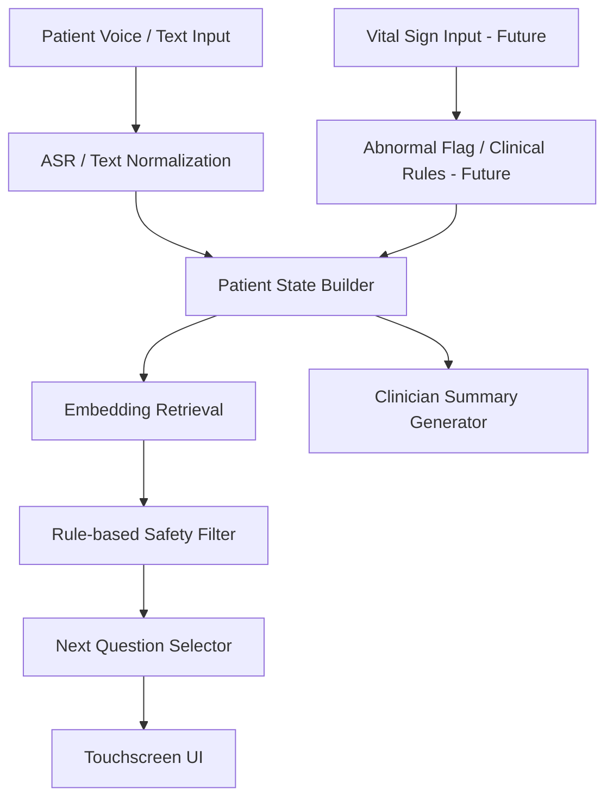

# User-Provided Extended Analysis - 2026-05-12 Prof. Wu Google Meet

Source: user-provided extended interpretation after the Google Meet transcript.

## Core Framing

這份逐字稿的核心不是「要立刻把 AI triage 做到完整」，而是吳老師把方向拉回到一個很務實的路徑：

```text
先找 FDA 510(k) 上已經被核准的類似產品，讀它的 510(k) summary、
intended use、indications for use、功能範圍，再反推 demo 應該做成
什麼樣子。
```

近期先做英文版 reference AP / demo，先能跑在慧誠智醫的 All-in-One 無 GPU 裝置上；vital sign 整合先不要硬接，等用途、訊號格式、醫學意義都清楚後再做。

## 1. 會議基本資料

**會議時間**  
2026 年 5 月 12 日晚上約 22:20

**會議形式**  
Google Meet 線上會議

**與會者**

- 林家聖 / Jason
- 吳育德老師

**會議主題**

慧誠智醫 AI triage project 後續方向討論，包含：

- 英文版 demo
- 無 GPU 裝置部署
- ASR + LLM / embedding model 的可行性
- vital sign 是否要整合
- FDA 510(k) 產品調查
- intended use / indications for use 定義
- 禮拜五會議準備
- 聯醫 / 衛生局深耕計畫可能連動
- 實驗室人力分工

## 2. 會議一句話總結

這場會議的結論是：

```text
不要先從技術幻想開始做 AI triage。
先從 FDA 510(k) 已通過產品的 intended use 出發，找出「美國市場已經接受的最小功能模式」，再做一個英文版、可部署、可展示、風險可控的 demo。
```

原本的壓力是：

```text
我要怎麼把 ASR、LLM、embedding、vital sign、醫學規範、triage 全部接起來？
```

吳老師把問題重新切小：

```text
先不要做完整醫療 AI。
先找已經被 FDA 接受的產品形態。
再仿照最簡單的方向做 reference AP。
```

## 3. 會議中的主要結論

### 3.1 慧誠智醫的近期需求

慧誠智醫目前對 demo 的期待大概有三個：

1. 全部改成英文。
2. 部署在慧誠智醫的 All-in-One 觸控式設備上。
3. 未來能結合 vital sign。

英文版 demo 不是單純翻譯 UI，而是 English clinical workflow demo。它要讓美國客戶看懂：

- 這個系統用在什麼情境
- 病人怎麼使用
- 醫護端看到什麼結果
- 系統如何根據病人回答產生下一題
- 系統最後輸出什麼資訊
- 這個 demo 和慧誠智醫設備的關係是什麼

近期真正要做的是：

```text
English clinical workflow demo
not just English UI translation
```

### 3.2 All-in-One 無 GPU 限制

慧誠智醫設備限制：

- 沒有 GPU
- 算力有限
- 可能需要接近 real-time
- 不能讓病人等太久
- 需要現場展示穩定

完整 LLM 放在設備上現階段不實際。比較可行的是：

- 小型 ASR model
- embedding model
- rule-based logic
- question bank retrieval
- precomputed embeddings
- local lightweight inference
- deterministic workflow
- 人工可審查的輸出

### 3.3 Vital sign 整合是未來目標，不是六月 demo 目標

慧誠智醫希望用設備產出的 physiological signals / vital signs 作為問答系統前提，可能包含：

- heart rate
- SpO2
- blood pressure
- respiratory rate
- body temperature
- 其他生理訊號

但目前還不能急著做，因為未知太多：

- 設備輸出的資料格式是什麼
- 是單點數值還是連續訊號
- 是否有時間序列
- 是否有 raw waveform
- 是否有 preprocessed value
- 是否有 abnormal flag
- 是否有醫療級校正
- 哪些 signal 對泌尿科真的有意義
- 哪些 signal 可以合理引導下一題
- 哪些 signal 只是背景資料，不能用來做 triage 判斷

判斷：

```text
這應該是最終目標，不是六月 demo 的近期目標。
```

## 4. 技術面分析

### 4.1 無 GPU 環境下，不應該把 full LLM 當核心

Full LLM 在無 GPU 環境會有：

- latency 高
- 使用者等待時間長
- 記憶體壓力大
- response 不穩定
- 現場 demo 風險高
- 難以控制醫療輸出
- hallucination 風險難管理

近期 demo 不應靠 LLM 即時生成醫療問題。

更穩的方式：

```text
LLM 用於開發階段，正式 demo 用 embedding retrieval + rule-based control。
```

流程：

1. 事先建立英文醫療問答題庫。
2. 每題附上 clinical intent、trigger condition、risk tag、department tag。
3. 使用 embedding model 找出下一題候選。
4. 用 deterministic rules 過濾不該問的問題。
5. 輸出下一題。
6. 記錄每一步的 reason trace。

### 4.2 ASR 可以小型化，但要設計 fallback

ASR 不能是唯一輸入方式。

醫療場域會有：

- 背景噪音
- 長者口音
- 英文非母語者
- 醫療術語辨識錯誤
- 病人講話斷斷續續
- microphone quality 問題

Demo 應提供三種輸入模式：

- Mode A：語音輸入，病人回答，ASR 轉文字。
- Mode B：文字輸入，ASR 錯誤時現場人員可以直接改字。
- Mode C：選項輸入，高風險問題用選項降低錯誤。

### 4.3 Embedding model 是近期最合理的核心

要展示的是：

```text
每一次的問題，是系統根據病人已回答內容計算後，從題庫中挑出下一個合理問題。
```

這不是靠 LLM 即時亂生成，而是：

- question bank
- patient state
- semantic retrieval
- rule gating
- next-question selection

醫療場域重視：

- 可解釋
- 可追蹤
- 可審核
- 可控制
- 可驗證

LLM 即時生成問題反而比較難過審查。

### 4.4 Vital sign 整合目前最大問題不是工程，而是醫學 mapping

核心問題：

```text
我怎麼從心率、血氧、血壓這些數值，推導下一個病人問題？
```

這需要 medical triage logic。例如：

- SpO2 低，要不要問呼吸困難？
- 心率高，要不要問胸痛、發燒、脫水、焦慮？
- 血壓高，要不要問頭痛、胸痛、視力模糊？
- 體溫高，要不要問感染症狀？
- 呼吸速率高，要不要問喘、胸悶、肺部病史？

近期正確做法：

```text
vital sign 先只顯示，不直接驅動 adaptive question。
```

更安全的 demo 設計：

1. 顯示 vital sign。
2. 標記 normal / borderline / abnormal / unknown。
3. 只提供 clinician-facing hint。

範例：

```text
Elevated heart rate detected. Consider confirming fever, pain, anxiety, or recent exertion.
```

這比「直接決定 triage level」安全很多。

## 5. 法規與 510(k) 分析

### 5.1 吳老師真正交代的核心任務

吳老師不是叫你直接讀所有 FDA 規範。

他要你做的是：

```text
找已經被 FDA 510(k) cleared 的類似產品。
```

然後看三個東西：

1. 510(k) summary
2. intended use
3. indications for use

### 5.2 為什麼 510(k) summary 很重要？

510(k) summary 通常會寫：

- 產品名稱
- 申請公司
- predicate device
- intended use
- indications for use
- device description
- technological characteristics
- performance testing
- risk controls
- substantial equivalence reasoning

對本案最重要的是：

```text
FDA 已經接受某一種產品被描述成什麼樣子。
```

要學的是：

- 它怎麼定義用途
- 它怎麼避免過度宣稱
- 它說自己是輔助誰
- 它有沒有做 diagnosis
- 它有沒有做 triage
- 它有沒有做 urgent classification
- 它輸出給 patient 還是 clinician
- 它是否只是收集和整理資訊
- 它是否給出 clinical recommendation

### 5.3 現在最該避免的風險

不要一開始就說：

```text
AI determines patient triage level.
```

更安全的定位：

```text
The system assists clinicians by collecting, organizing, and summarizing patient-reported information before clinical evaluation.
```

或者：

```text
The system supports pre-visit intake by presenting structured symptom information and possible follow-up questions for clinician review.
```

### 5.4 要找的 predicate device 類型

- Triage / patient intake software
- Clinical decision support software
- Vital sign-based screening system
- Emergency triage support system
- Telehealth / remote patient monitoring intake system

## 6. 產品定位分析

### 路線 A：低風險英文版 previsit intake demo

近期最適合。

定位：

```text
病人報到前，系統用英文收集症狀和基本資訊，整理給醫護人員。
```

功能：

- ASR / text input
- question bank
- adaptive next question
- symptom summary
- clinician-facing report
- no diagnosis
- no final triage decision
- no autonomous urgency ranking

### 路線 B：medium-risk clinical triage assistant

定位：

```text
系統根據病人回答與部分 vital sign，提示可能需要優先注意的風險。
```

需要：

- guideline mapping
- physician review
- validation data
- risk table
- audit trail
- human-in-the-loop design

### 路線 C：high-risk AI triage classifier

定位：

```text
系統直接分流病人或建議急迫程度。
```

不適合現在直接做，因為醫學責任、法規壓力、臨床驗證、false negative 風險和 demo 失誤代價都太高。

## 7. 目前最合理的開發方向

# English Reference AP v1

定位：

```text
An English pre-visit intake and adaptive questioning demo for clinician review, designed to run on a GPU-free All-in-One touchscreen device.
```

核心特色：

1. 英文介面
2. 病人可語音或文字回答
3. 系統根據回答挑下一題
4. 題目來自固定題庫
5. embedding model 負責找候選題
6. rules 負責安全過濾
7. 最後產生 clinician summary
8. vital sign 暫時只作為 display / future integration placeholder
9. 不做 diagnosis
10. 不做 final triage decision

## 8. 禮拜五前應準備什麼

建議準備 5 份材料：

1. 一頁式方向圖：`AI Pre-Visit Intake Demo for GPU-Free Touchscreen Device`
2. 一頁式近期 / 中期 / 長期 roadmap
3. 一頁式 technical architecture
4. 一頁式 regulatory positioning
5. 一頁式 `510(k)` research plan

### Suggested Technical Architecture



### Regulatory Positioning Sentence

```text
The current demo is intended as a pre-visit information collection and clinician review support tool. It does not provide diagnosis, final triage decisions, or emergency treatment recommendations.
```

### 510(k) Research Plan

1. Search FDA 510(k) database.
2. Identify similar triage / intake / vital sign screening products.
3. Extract intended use and indications for use.
4. Compare product functions.
5. Identify simplest cleared product pattern.
6. Discuss medical interpretation with 冠廷 / 多寶.
7. Align demo scope with the safest feasible pattern.

## 9. 人力分工建議

### Jason

- overall system design
- English demo
- ASR + embedding architecture
- question selection logic
- 510(k) survey 初稿
- product demo narrative
- technical roadmap

Role:

```text
AI triage product architect
```

### 多寶

- 醫學問題解釋
- clinical question 合理性
- 病人回答如何理解
- 醫療英文表述
- 禮拜五會議支援
- LLM-related medical workflow discussion

### 冠廷

- 醫學規則
- clinical interpretation
- vital sign 是否合理連到某些問題
- 510(k) intended use 的醫學意義

### 俊邑

- signal processing
- vital sign data format
- continuous signal handling
- feature extraction
- abnormal signal preprocessing

### 吳老師

- strategy
- 方向校正
- 場域連結
- 聯醫 / 衛生局深耕計畫
- 找資深醫師
- 判斷何時需要加人

## 10. 聯醫 / 衛生局深耕計畫的連動意義

深耕計畫可能有三大主題：

1. 連江縣 HIS 系統更換
2. 職業壓力症候群、自律神經、壓力、情緒評估
3. 社區篩檢、抽血資料、退化速度分析

AI triage project 比較可能連到第三類：

```text
community screening / 社區篩檢 / 分流 / triage
```

醫療 AI 最難的是場域。產品需要：

- 可以放到社區篩檢場域
- 可以讓醫護真的操作
- 可以收集 feedback
- 可以反覆修正
- 可以變成採購可能性

## 11. 隱含訊息

### 11.1 不要陷入技術過度設計

Intended use 沒定義前，技術做再多都可能走錯。

### 11.2 對方自己也還沒定義清楚產品用途

不能等對方給完整 spec。要反過來提供一個可討論框架：

```text
我們查了 FDA 510(k) 類似產品後，建議先把這個 demo 定位為 pre-visit intake / clinician review support。
```

### 11.3 真正交付的是方向感

禮拜五最重要的輸出是：

```text
clear scope + safe roadmap + feasible demo plan
```

## 12. 風險分析

### 最大技術風險

無 GPU 裝置無法穩定跑完整 AI pipeline。

解法：

- 不跑 full LLM
- 使用 small ASR
- 使用 embedding retrieval
- 題庫預先建立
- embeddings 預先計算
- question selection 用 rules 控制
- output templates 固定化

### 最大醫學風險

系統問了不該問的問題，或根據 vital sign 做出錯誤推論。

解法：

- 題庫由醫學人員審查
- 問題加上 clinical intent
- 不讓 vital sign 直接決定 triage
- 先做 clinician-facing summary
- 不做 autonomous diagnosis

### 最大法規風險

Demo 用語讓人以為系統可以做醫療決策。

避免使用：

- diagnosis
- determine urgency
- decide triage level
- emergency recommendation
- treatment suggestion

改用：

- collect
- organize
- summarize
- assist clinician review
- suggest follow-up questions
- highlight information for clinician review

### 最大合作風險

慧誠智醫希望快速接 vital sign，但目前沒有資料格式、醫學 mapping、法規定位。

建議回應：

```text
We can support vital sign integration as a staged roadmap. For the first English reference demo, we recommend showing vital signs as contextual information only. After we confirm the device output format and review similar FDA 510(k)-cleared products, we can define how vital signs should safely influence follow-up questions.
```

## 13. 接下來工作清單

### 今天晚上 / 明天早上

1. 整理英文版 demo scope。
2. 列出目前不能承諾的功能。
3. 準備 510(k) search keywords。
4. 找 3-5 個類似 FDA 510(k) 產品。
5. 摘出 intended use / indications for use。
6. 寫一頁「建議的最小 demo 定位」。

### 禮拜五前

建議文件標題：

```text
AI Pre-Visit Intake and Adaptive Questioning Demo
For GPU-Free Touchscreen Deployment
```

內容大綱：

1. Background
2. Device constraints
3. Near-term demo scope
4. AI architecture
5. What the system does
6. What the system does not do
7. Vital sign integration roadmap
8. FDA 510(k) research direction
9. Questions for 慧誠智醫
10. Next steps before June demo

## 14. 要問慧誠智醫的問題

### 14.1 設備問題

1. All-in-One device 的 CPU 型號是什麼？
2. RAM 多大？
3. OS 是 Windows 還是 Android？
4. 可以安裝 Python runtime 嗎？
5. 可以跑 local server 嗎？
6. 是否允許連網？
7. 是否需要完全 offline？
8. 麥克風規格是什麼？
9. 是否有觸控鍵盤？
10. Demo 時是否可接外部筆電？

### 14.2 Vital sign 問題

1. 目前會輸出哪些 vital signs？
2. 每個 signal 是即時連續資料還是測量完成後的單點數值？
3. 資料格式是 JSON、CSV、HL7、FHIR，還是 proprietary format？
4. 是否有 timestamp？
5. 是否有 abnormal flag？
6. 是否有 reference range？
7. 是否有測量品質指標？
8. 是否能提供 sample data？
9. 是否能提供 mock API？
10. 六月 demo 是否一定要接真實 vital sign？

### 14.3 產品定位問題

1. 美國客戶想看的是門診前問答、急診分流，還是社區篩檢？
2. 使用者是病人、護理師、醫師，還是行政人員？
3. 系統輸出給誰看？
4. 系統是否需要給出 urgency level？
5. 是否需要建議科別？
6. 是否需要產生報告？
7. 是否要進入 EMR / HIS？
8. 是否目前已有 510(k) 產品名稱或文件？
9. 美國合作客戶使用的既有產品是哪一套？
10. 他們期待六月 demo 看到什麼畫面？

## 15. 建議對慧誠智醫的回覆方向

```text
我整理了一下今天討論後的方向。因為目前設備是 All-in-One touchscreen，
且沒有 GPU，所以我們建議第一版 English reference demo 先採取比較穩定
的架構：ASR / text input + question bank + embedding-based next-question
selection + rule-based safety filter + clinician-facing summary。

Vital sign 的部分，我們建議先作為 contextual display 或 future integration
placeholder，不建議第一版就直接用 vital sign 自動決定 triage 或產生醫療
判斷。原因是我們需要先確認設備輸出的 signal format、每個 vital sign 的
醫學意義、以及 FDA 510(k) 類似產品的 intended use / indications for use。

接下來我們會先 survey FDA 510(k) 上類似的 triage / intake / screening
product，找出最接近且最安全的產品定位，再回推 demo scope。這樣六月給
美國客戶看的 demo 會比較穩，也比較符合未來產品化與法規討論的方向。
```

## 16. 這場會議對你的真正意義

這場會議把 AI triage project 從「技術題」轉成「產品化題」。

技術題：

```text
我能不能做 ASR + LLM + vital sign + triage？
```

產品化題：

```text
在無 GPU 設備上，面對美國客戶與可能的 FDA 路徑，我們應該先展示哪個最小、穩定、安全、可說服人的版本？
```

現在要做的是第二個。

## 17. 判斷

- 不要把 demo 做成「AI 醫師」。
- 要把 demo 做成「AI pre-visit intake assistant」。
- 不要讓 vital sign 直接控制 triage。
- 先讓 vital sign 變成 context。
- 不要讓 LLM 自由生成醫療問題。
- 先用醫學題庫 + embedding + rules。
- 不要急著宣稱 FDA compliance。
- 先說 FDA `510(k)`-aligned research direction / similar cleared-product survey / intended-use alignment。

## 18. 最後整理

下一步不是「做更強的 AI」。

下一步是：

```text
找到 FDA 510(k) 已經接受的最小醫療產品形態，做一個英文、可部署、可解釋、可展示、低風險的 AI pre-visit intake demo。
先讓美國客戶看懂價值，再逐步接 vital sign、醫師審查、臨床規則與場域驗證。
```

