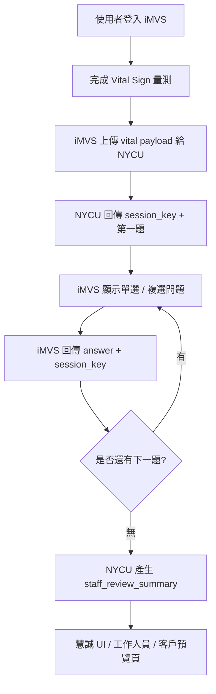
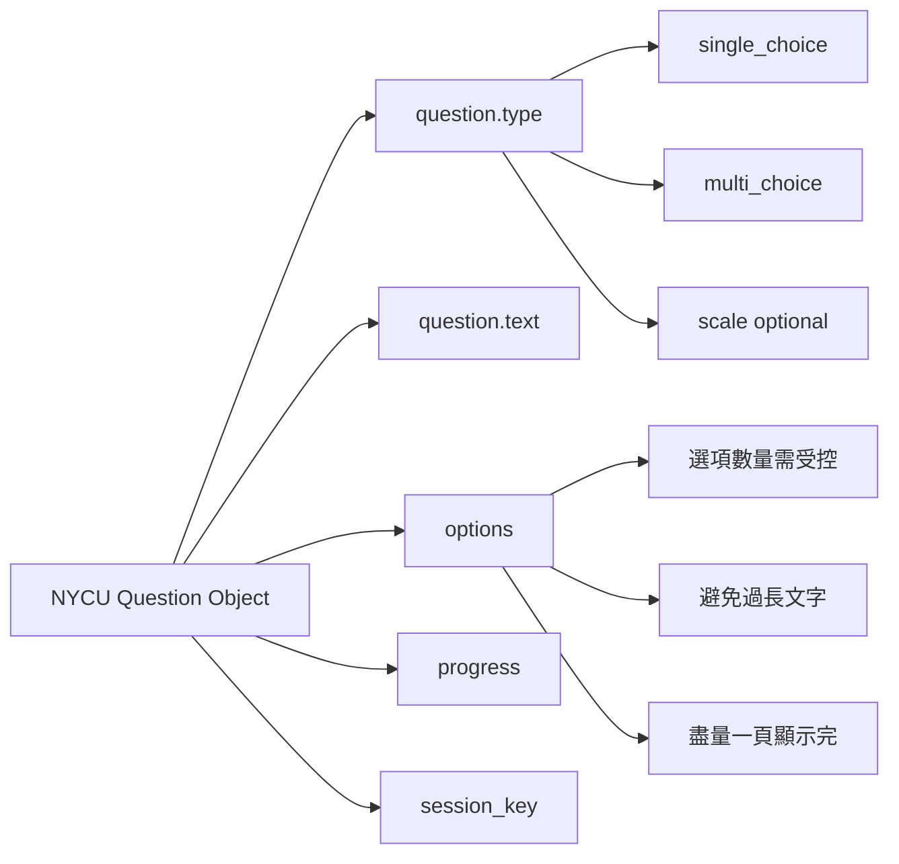
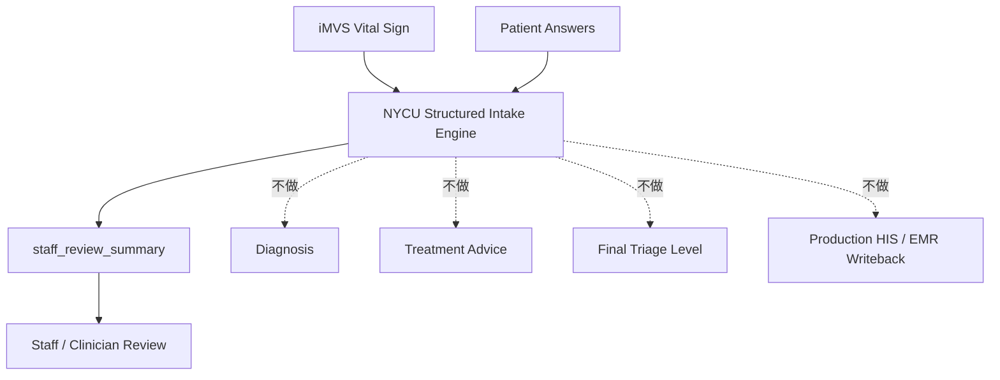

# AI-Triage 合作會議記錄（NYCU 吳老師團隊 × 慧誠智醫）260521

**會議日期：** 2026/05/21 (Thursday)

**會議時間：** 約 09:59 開始

**會議主題：** iMVS / NYCU AI Triage Demo 工程同步、API v0.2、UI 串接與六月 Demo 流程確認

**參與人員：**

### 慧誠智醫（iMedtac）

- Johnny Fang（PM / Product / 協調窗口）
- Ben（工程團隊代表）
- 慧誠 UI / 設計團隊成員
- 其他慧誠團隊成員

### NYCU 團隊

- Jason Lin（阿聖，NYCU demo / API 負責人）
- 多寶 / 許醫師（臨床與 demo case / 問題流程協助）

---

# 一、這次會議與前幾次最大的差異

前兩次會議主要在確認：

```
AI 問診 + Vital Sign + Kiosk
是否能形成一個 AI-Triage / Urgent Care Intake 的產品方向
```

這次會議進一步進入：

- API 要怎麼接；
- iMVS 量測完後怎麼把 vital sign 傳給 NYCU；
- NYCU 怎麼回傳 `session_key` 與下一題；
- 問題 UI 要支援哪些題型；
- 六月 demo 要用哪一種實際可演出的 case；
- demo 當天如果 API / 網路出問題，怎麼 fallback；
- `AI triage` 到底要輸出什麼，怎麼避免被誤解成醫療診斷。

也就是說，這次會議已經不是單純討論「AI 能做什麼」，而是開始處理：

```
六月 demo 的工程合約、現場腳本、產品邊界與風險控制
```

這是專案從概念討論進入工程落地的關鍵會議。

---

# 二、會議核心背景

慧誠智醫目前已有 iMVS 生理量測 kiosk / web service flow。原本流程大致是：

```
使用者登入
↓
開始生命徵象量測
↓
完成各項量測
↓
顯示量測報告
```

NYCU 端希望把 AI intake / triage support 插入這個流程中，使 iMVS 不只是「量測設備」，也可以成為：

```
Vital-aware intake workflow 的入口
```

會前 NYCU 建議的方向是：

```
iMVS 合成生命徵象 payload
→ NYCU 結構化 / 選項式動態問診
→ iMVS 回傳回答 payload 與 session_key
→ NYCU 產生 staff_review_summary
→ 工作人員 / 臨床人員檢閱
```

六月版本仍維持 demo-only、synthetic data、staff review、read-only flow，不做診斷、不做治療建議、不做 final triage / acuity level，也不做 production HIS / EMR / FHIR writeback。

---

# 三、本次會議真正收斂的六月 Demo Flow

會前 NYCU 原本提出 two-phase flow：

```
Phase 1：量測生命徵象時，同時問不依賴 vital sign 的問題
Phase 2：生命徵象完成後，再問 vital-aware follow-up questions
```

這個設計的優點是節省時間，也比較接近醫院現場護理師邊量測邊問問題的流程。

但慧誠工程端與 Johnny 從 demo 成本與現有 iMVS 流程考量後，最後會議傾向六月先採用更保守的流程：

```
iMVS 先完成 Vital Sign 量測
↓
iMVS 呼叫 NYCU API，上傳 vital payload
↓
NYCU 回傳 session_key + 第一題
↓
iMVS 顯示問題並回傳 answer
↓
NYCU 回傳下一題
↓
重複 7～8 題以內
↓
NYCU 回傳 staff_review_summary / demo result
↓
慧誠 UI 顯示給工作人員 / 客戶預覽
```

這個決策的理由很務實：

- six-week / mid-June demo 時程短；
- 原本 iMVS flow 已經存在，不適合在六月大改；
- 邊量測邊問問題雖然合理，但會牽涉 posture、signal quality、UI 狀態與使用者操作衝突；
- demo 第一階段只需要證明「Vital + AI intake」能力，不需要一次做到最佳流程。



---

# 四、API / Session Contract 的會議共識

這次 API 討論收斂得很清楚。

原本 API v0.2 設計有三個 endpoint：

```
POST /api/triage-demo/sessions
POST /api/triage-demo/sessions/{session_key}/answers
POST /api/triage-demo/sessions/{session_key}/vitals
```

但在六月 demo 的 post-measurement-only flow 下，Endpoint 1 與 Endpoint 3 可以先合併。

也就是：

```
量完 Vital Sign 後
→ iMVS 打第一支 API
→ 同時送 vital payload
→ NYCU 建立 session
→ NYCU 回傳 session_key + first question
```

接著使用 Endpoint 2 做 answer loop：

```
iMVS 送出 answer + session_key
→ NYCU 回傳 next question
→ 最後回傳 staff_review_summary
```

Ben 也在會中確認這個流程沒有問題，只是希望 NYCU 對 request fields 補上更明確說明，尤其是 `idempotency_key` 這類工程欄位。

## API 共識整理

| 項目 | 會議結論 |
| --- | --- |
| Session state | 六月 demo 建議由 NYCU 產生 `session_key`，iMVS 後續 echo 回來 |
| Vital payload | 量完後由 iMVS 一次送給 NYCU |
| Endpoint 1 / 3 | 六月 demo 可合併 |
| Answer loop | iMVS 每次送 answer，NYCU 回 next question 或 summary |
| 題數 | 控制在 7～8 題以內 |
| 運算延遲 | NYCU 表示扣除網路 latency，後端運算約不到 1 秒 |
| 欄位補充 | NYCU 需補上 request fields 說明，例如 `idempotency_key` |

---

# 五、Vital Payload 與欄位格式

NYCU 端原本準備了一個 vital payload 的建議 shape，包括：

- 體溫；
- 血氧；
- 心跳；
- 呼吸速率；
- 血壓；
- 單位；
- measurement status；
- quality flag；
- missing reason。

但 Ben 說慧誠先前已提供 Vital Upload API / GitHub 格式，因此六月 demo 可能直接依照慧誠既有格式處理。

這裡形成一個實務共識：

```
NYCU 不硬要求慧誠改 payload 格式。
慧誠提供現有 Vital Upload API 格式。
NYCU 依慧誠格式製作 adapter。
```

但仍需要慧誠工程端提供：

- 實際 field name；
- 單位；
- required / optional；
- missing / failed / poor quality 的表示方式；
- 哪些欄位一定有，哪些欄位可能沒有；
- 血壓是否拆成 systolic / diastolic；
- SpO2、temperature、heart rate 等欄位的實際 key。

這件事會直接影響 NYCU 後端判斷下一題的方式。

---

# 六、問題型態與 UI 設計

這次會議確認六月 demo 的問題型態先以：

- `single_choice`
- `multi_choice`

為主。

必要時才加入：

- `scale`

主訴也建議先用 single choice。原因很簡單：真實病人可能會講很多，但六月 demo 需要穩定、可控、容易接 UI，所以先用選項式問題。

慧誠 UI / 設計端也提出重要限制：

```
問題選項最好能在同一頁完整顯示。
盡量不要讓 user 需要拖曳或滑動。
```

這代表 NYCU 設計問題時，需要控制：

- 選項數量；
- 每個選項的字數；
- 複選題最大選項數；
- 是否需要「以上皆無」；
- 問題文字是否足夠短；
- 英文 demo wording 是否清楚。



---

# 七、iMVS UI Flow 的插入點

慧誠 UI 展示目前 iMVS flow：

```
登入
↓
顯示量測項目
↓
逐項量測生命徵象
↓
必要時手動輸入
↓
顯示量測報告
```

會議中形成的方向是：

```
AI 問題系統插在「量測完成」與「最後報告」之間
```

也就是：

```
完成 Vital Sign 量測
↓
進入 AI structured question flow
↓
問完後再顯示報告 / demo result
```

慧誠 UI 端也提到，實際情境中 triage / intake 資料應該是回到醫院 HIS；但六月 demo 可以開一個新按鈕或預覽頁，讓客戶看到結果大概會長什麼樣子。

重要邊界：

```
病人端不一定看到 staff_review_summary。
結果頁主要給工作人員、醫師或 demo 客戶預覽。
```

---

# 八、Voice Input 的決策

會議中 Johnny 明確問：

```
demo 版本會不會用到語音？
```

NYCU 回覆：

```
六月 demo 先不會。
```

理由包含：

- demo 電腦目前沒有麥克風；
- ASR 會增加硬體需求；
- ASR 會增加辨識錯誤與 latency；
- ASR 會帶來 raw audio 隱私問題；
- 六月主要要證明 vital payload + structured intake + summary flow；
- touch / choice-based flow 已經足夠展示主線能力。

所以本次會議後，voice input 應被放到 future scope。

```
六月 critical path：
touch / choice-based flow

六月以後：
ASR / 語音補充 / multilingual input
```

---

# 九、Remote API 與 Local Fallback

NYCU 端目前 AI engine / backend 放在實驗室端。慧誠端 iMVS demo 電腦理論上可以連外網，因此正常情況可以走：

```
iMVS / demo UI
↓
NYCU lab backend / server
↓
AI intake engine
↓
回傳問題與 summary
```

但 Jason 也提出一個重要 fallback：

```
如果 API 或網路當天出問題，先準備一套 local scripted demo / fake demo system 放在慧誠端。
```

這個 fallback 的目的不是假裝正式產品，而是確保客戶 demo 不會因為網路或 API 暫時出問題而中斷。

正式紀錄中建議將兩種模式清楚命名：

| 模式 | 意義 |
| --- | --- |
| Remote REST API Mode | 正常 demo，iMVS 呼叫 NYCU backend |
| Local Scripted Demo Mode | 備援 demo，使用預先寫好的 synthetic flow |
| Static Mock Mode | 最保守備案，只展示流程與結果頁 |

這一點很重要。Fallback 必須在內部清楚標記，避免被誤解成 live AI API result。

---

# 十、Demo Case 設計與現場可演出性

NYCU 原本建議第一個 demo case 使用：

```
呼吸喘 + 發燒 + 較低血氧
```

原因是這個 case 最能展示 vital sign 對後續問題的影響。

但 Johnny 從現場 demo 的角度提出很實際的問題：

```
血氧很難用真人控制。
心率可以跑步或深蹲提高。
體溫可以用熱水等方式模擬。
血壓不容易精準控制。
```

因此，呼吸喘 + 低血氧 case 雖然臨床展示性強，但現場可演出性比較差。

會中提到目前 NYCU 已準備三到四個 synthetic cases：

1. **右上腹痛 + 發燒**
    - Jason 心中設定類似急性膽囊炎；
    - 年輕男性；
    - 用來展示腹痛與發燒情境。
2. **心跳快 / 心悸 / 胸悶**
    - 76 歲女性；
    - 曾有心律不整；
    - heart rate 明顯偏高；
    - 可能較適合現場演出，因為心率可透過跑步或深蹲提高。
3. **呼吸喘 + 血氧較低**
    - 原本主推的 respiratory case；
    - 醫療展示性強；
    - 但真人 demo 不容易控制 SpO2。
4. **年輕女性發燒 / 上呼吸道感染**
    - 比較輕症；
    - 可做健康組 / 輕症組對照。

Johnny 建議 demo 腳本最好設計成：

```
健康組 vs 不健康組
```

讓客戶清楚看到：

```
不同 vital sign + 不同回答
→ 產生不同 AI intake / summary 結果
```

這樣客戶比較容易感受到 AI engine 的存在。

---

# 十一、AI Triage 的產品定位問題

本次會議最關鍵的產品問題是 Johnny 提出的：

```
如果最後輸出只是病人描述與量測事實，那 triage 在哪裡？
```

這個問題很重要。因為如果 output 只是：

- 主訴；
- 體溫；
- 血氧；
- 過敏史；
- past history；
- 症狀整理；

那它比較像：

```
intake summary / questionnaire summary
```

不一定能被稱為 triage。

Jason 原本提到可能會產生五級檢傷結果，但 Johnny 提醒：

- 五級檢傷比較像急診；
- urgent care 情境可能多數是 3、4、5 級；
- 一旦出現判斷行為，就會碰到醫療責任；
- 產品定位與 value proposition 要先講清楚；
- 不要讓客戶以為它可以取代護士或正式檢傷流程。

因此，本次會議後，建議對外說法要更保守：

```
vital-aware intake support
AI-assisted staff-review intake workflow
synthetic-data workflow demo
```

避免直接講：

```
AI diagnosis
final triage level
clinical-grade AI triage
AI replaces nurse triage
treatment recommendation
```

這也是本次會議中最大的產品修正。

---

# 十二、本次真正形成的系統定位

這次會議後，系統比較精準的定位應該是：

## 不是：

```
AI 自動診斷系統
AI 自動檢傷系統
AI 自動分流決策系統
AI 替代護理師系統
```

## 而是：

```
Vital-aware AI Intake Support System
```

它做的事情是：

- 收集病人主訴；
- 結合 iMVS vital sign；
- 根據回答與 vital context 問下一題；
- 產生 staff_review_summary；
- 協助工作人員或醫護人員更快掌握狀況；
- 保留 human review 作為最後決策點。



---

# 十三、本次會議形成的短期 Action Items

```mermaid
flowchart TD
    A[Next Actions] --> B[慧誠工程團隊]
    A --> C[慧誠 UI / 設計]
    A --> D[Johnny / Product]
    A --> E[Jason / NYCU]
    A --> F[多寶 / 許醫師]
    A --> G[隱私 / 資安 Owner]

    B --> B1[提供 Vital Upload API 實際欄位與單位]
    B --> B2[確認 required / optional / missing / failed semantics]
    B --> B3[確認外網 / CORS / firewall / local fallback 條件]

    C --> C1[確認 AI 問題插入點]
    C --> C2[確認結果頁 / report button 呈現方式]
    C --> C3[確認單選 / 複選 UI 限制]

    D --> D1[確認六月 demo 日期與客戶情境]
    D --> D2[設計現場演出腳本]
    D --> D3[建立 Teams / Line 工程溝通管道]

    E --> E1[更新 API v0.2 欄位說明]
    E --> E2[補 idempotency_key 等工程欄位解釋]
    E --> E3[準備 local scripted fallback]
    E --> E4[設計可演出的多個 demo cases]

    F --> F1[確認 case realism]
    F --> F2[確認 safe question wording]
    F --> F3[確認 staff_review_summary 邊界]

    G --> G1[確認 no real identifiers]
    G --> G2[確認 no raw audio]
    G --> G3[確認 no production HIS / EMR endpoint]
```



---

# 十四、各方具體任務

## 1. 慧誠工程團隊

需要提供：

- iMVS 實際 Vital Upload API 格式；
- field names；
- units；
- required / optional；
- missing / failed / poor quality 表示方式；
- 是否能使用 external HTTPS endpoint；
- demo 電腦網路條件；
- 是否有 CORS / firewall / VPN / WebView 限制；
- local scripted fallback 是否能放進 iMVS UI；
- 後續工程窗口與溝通方式。

---

## 2. 慧誠 UI / 設計團隊

需要確認：

- AI 問題 flow 插在量測報告前；
- 問題頁支援 single choice / multi choice；
- 選項數量與文字長度限制；
- 是否支援 progress 顯示；
- 問完後報告頁如何呈現；
- staff result 是否只給工作人員或 demo 客戶看；
- 是否需要新按鈕顯示 AI result / summary。

---

## 3. Johnny / Product

需要確認：

- 六月 demo 確切日期；
- 客戶是誰、現場誰操作；
- demo 是要證明 UI、API，還是 workflow value；
- 是否採健康組 / 不健康組對照；
- 哪些 vital sign 現場能演；
- 哪些 vital sign 不適合真人控制；
- 對外應使用 `AI triage` 還是較安全的 `vital-aware intake support`；
- 工程團隊後續是否直接與 NYCU 對接。

---

## 4. Jason / NYCU

需要完成：

- API v0.2 更新版；
- request field 說明；
- `idempotency_key` 說明；
- `session_key` 行為說明；
- answer loop example；
- staff_review_summary example；
- local scripted fallback demo；
- 多個 synthetic demo cases；
- 根據現場可控性調整 case；
- 與許醫師安排實際看 iMVS 機器。

---

## 5. 多寶 / 許醫師

需要協助：

- 確認問題設計是否臨床合理；
- 確認哪些問題適合 kiosk 問；
- 確認哪些 wording 不應出現；
- 確認 respiratory / tachycardia / fever case 哪一個最適合第一個 demo；
- 確認 staff_review_summary 不被寫成診斷；
- 確認是否需要 early handoff；
- 協助設計現場可演出的 case。

---

# 十五、本次會議留下的關鍵未決問題

## 1. 第一個正式 demo case 是否仍採 respiratory low-SpO2？

目前 respiratory case 醫療展示性強，但現場 SpO2 不容易控制。tachycardia case 可能更容易演。

建議下一步：

```
準備兩條 demo lane：
A. Respiratory synthetic lane
B. Tachycardia live-performance lane
```

## 2. `AI triage` 是否應改名？

建議內部仍可稱 AI triage demo，但對客戶說法應更保守：

```
AI-assisted vital-aware intake support
```

原因是「triage」容易讓人期待正式檢傷分級或醫療決策。

## 3. summary 是否要出現五級檢傷？

不建議六月 demo 出現正式五級檢傷結果。

建議改為：

```
staff_review_summary
review_basis
review_action
staff_handoff_note
```

## 4. local fallback 要怎麼標示？

必須清楚標示：

```
Local Scripted Demo Mode
```

避免被誤認為 live AI API result。

## 5. 病人是否能看到 summary？

目前建議：

```
病人不看 staff summary。
工作人員 / 醫師 / demo 客戶可看 summary 頁。
```

---

# 十六、這次會議真正的結論

這次會議的核心結論是：

```
六月 demo 先不追求完整 AI triage。
先完成一個 iMVS vital payload → NYCU structured question loop → staff_review_summary 的可展示閉環。
```

這個閉環比「模型多聰明」更重要。

因為客戶真正要看到的是：

```
iMVS 量測資料
可以進入 AI intake workflow
並產生一個醫護人員可以理解的摘要
```

而不是看到一個黑盒子 AI 宣稱自己會診斷。

本次會議也把專案定位拉回正確方向：

```
不是 AI model demo。
是 medical workflow integration demo。
```

下一步最重要的是：

1. 慧誠提供真實 vital payload 格式；
2. NYCU 更新 API v0.2；
3. 多寶確認 safe clinical wording；
4. Johnny 與慧誠設計現場可演出的 demo 腳本；
5. Jason 準備 live API mode 與 local fallback mode；
6. 雙方安排實際看 iMVS 機器。

---