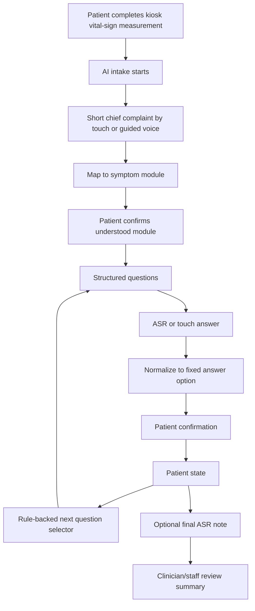

# Workstream 07 - Guided ASR And Structured Questionnaire

Date: 2026-05-13  
Status: active ASR design analysis for 慧誠 discussion

## Core Thesis

The ASR design should be:

```text
Guided ASR + Structured Questionnaire
```

not:

```text
Open-ended ASR Chatbot
```

This preserves the company goal of voice interaction while keeping the clinical
workflow structured enough for clinician review, source traceability, CPU-only
deployment, and June demo stability.

## Why Structured First

The first-principles goal is:

> help medical staff obtain enough pre-diagnostic information with less
> repetitive questioning.

The system should compress patient input into clinician-usable structure, not
produce long transcripts that staff must read and reinterpret.

Structured answer types are the right default:

| Answer type | Use |
| --- | --- |
| Single choice | duration, location, chief complaint category |
| Multiple choice | associated symptoms, body areas, concurrent complaints |
| Yes / no / not sure | red flags and safety questions |
| Numeric scale | pain score, severity, frequency |
| Short ASR note | final patient concern or staff-assisted note |

Recommended rough ratio for urgent-care demo design:

| Type | Approximate share |
| --- | ---: |
| Single choice | 45% |
| Yes / no / not sure | 30% |
| Numeric scale | 10% |
| Multiple choice | 10% |
| Open note | 5% |

## Open-Ended ASR Risk

Open-ended ASR creates four problems:

1. Patient answers become too diffuse.
   - Patients may describe history, anxiety, family comments, medication,
     uncertainty, and unrelated details in one answer.
   - The system then needs medical NLP, extraction, filtering, and confirmation.
2. ASR errors can change medical meaning.
   - "no fever" versus "fever";
   - "can't breathe well" versus "can breathe well";
   - "left arm pain" versus another body part.
3. Red-flag routing becomes hard to verify.
   - If the system infers a red flag from free text, every inference needs
     auditability and clinician sign-off.
4. The kiosk hardware path becomes too heavy.
   - The target environment is CPU-only and should not depend on cloud LLM or
     GPU services for the basic demo path.

## Recommended UX Pattern



## ASR Usage Rules

### Good ASR Uses

- short chief complaint mapping;
- voice selection of fixed options;
- voice entry for a numeric pain score;
- final "anything else staff should know" note;
- staff-assisted note capture.

### Unsafe Or Premature ASR Uses For v0

- patient freely chats with the system for the whole interview;
- ASR transcript directly determines urgency;
- free text directly triggers final triage level;
- LLM writes new medical questions during runtime;
- unconfirmed ASR transcript enters the clinician summary as fact.

## Confirmation Loop

Every clinically meaningful ASR result should be confirmed.

Examples:

```text
We understood your main concern as:
Pain or burning during urination

[Correct] [Choose another]
```

```text
You answered:
Yes, I have chest discomfort now.

[Correct] [Change answer]
```

This is especially important for red flags, negation, body side, severity, and
duration.

## Clinical Product Boundary

The AI role should be stated precisely:

- map natural-language chief complaint to a symptom module;
- select the next approved question from a fixed question bank;
- summarize structured answers and vital-sign context for clinician review;
- expose source IDs and review status where possible.

The AI role should not be:

- autonomous diagnosis;
- final ESI / triage-level assignment;
- treatment instruction;
- opaque free-form reasoning over unreviewed speech.

## Suggested Roadmap

| Version | Scope |
| --- | --- |
| Demo v0 | Structured touch-first intake plus optional final ASR note. |
| Demo v1 | Guided voice for chief complaint and fixed-answer selection with confirmation. |
| Demo v2 | Vital-sign-triggered adaptive intake from approved question bank. |
| Product v3 | Validated triage-support workflow with clinical review, human factors testing, privacy, cybersecurity, and change control. |

## Answer To The Design Question

Closed or guided questions are more appropriate than open-ended ASR for the
current project stage.

Open-ended ASR can exist only in bounded places, mainly short chief complaint
input and final optional note. The core clinical intake should remain
structured, source-governed, and confirmed by the patient before it appears in
the clinician summary.

