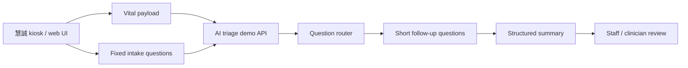

# June Demo Case And Integration Plan

## First Principle

- Scarce resource: execution bandwidth before the June customer demo.
- Canonical source: `source/2026-05-15-huicheng-second-sync-and-duobao-followup/`.
- Near-term output: a believable, synthetic, urgent-care intake demo.
- Boundary: clinician-review summary only; no diagnosis, treatment, test order,
  final triage level, or live patient deployment claim.

## Current Decision

The v0 demo should be:

```text
vital-sign kiosk context
  -> short guided intake
  -> vital-aware follow-up
  -> structured summary for staff
```

It should not be:

```text
all-specialty autonomous AI triage
  -> diagnosis
  -> treatment / order suggestion
  -> production EMR writeback
```

## Company Minutes Update

Johnny Fang's company-side minutes after the meeting are preserved at:

- `source/2026-05-15-huicheng-second-sync-and-duobao-followup/company-provided-meeting-minutes.md`

They confirm the June urgent-care demo frame, `3-5` cases, touch plus partial
voice input, `8-10` question budget, and doctor-facing chief-complaint summary.

They also create three items to confirm before implementation:

- `AI 資料訓練 study` should mean synthetic demo / model-feasibility study unless
  real data governance is separately approved.
- `比較完整的解讀結果` should be constrained to a clinician-review summary, not
  diagnosis, treatment, or final triage level.
- Case examples should be reconciled: 慧誠 listed trauma / chronic disease /
  allergy, while our clinical follow-up favored fever/respiratory,
  abdominal-pain/fever, tachycardia/chest tightness, and low SpO2.

## Implementation Shape



## Work Packages

| Package | Owner | First concrete output |
| --- | --- | --- |
| Case pack v0 | Jason + 多寶 | `3-5` synthetic cases with vitals, question path, and output boundary. |
| Kiosk question flow | Jason | One fixed-question phase and one vital-aware follow-up phase. |
| Clinical stop rule | 多寶 | What the kiosk may ask vs what must be left to clinicians. |
| API bridge sketch | Jason + 慧誠 tech | JSON fields and call sequence for vital payload and summary return. |
| UI integration path | 慧誠 + Jason | Decide same-app, iframe/link, external backend, or demo-only screen handoff. |
| Demo compute path | Jason + 慧誠 | Confirm networked external compute is acceptable for June. |

## First 48-Hour Path

1. Jason creates the source bundle, action plan, and case-pack starter.
2. 多寶 writes simple clinical case drafts and question stop rules.
3. Jason turns the first case into:
   - a synthetic vital payload;
   - a guided question sequence;
   - a clinician-facing summary template.
4. Jason sends 慧誠 a technical question list:
   - target device and UI entry point;
   - API payload shape;
   - demo room network;
   - acceptable external-compute path;
   - output display format.
5. Jason asks 慧誠 to clarify whether `AI 資料訓練 study` means synthetic demo /
   feasibility work and whether the first cases should include trauma / chronic
   disease / allergy.
6. Jason and 多寶 review whether the first case feels medically plausible but
   still safely non-diagnostic.

## What To Build First

Start with one case only:

```text
Fever + cough / shortness of breath
```

Why:

- It naturally uses temperature and SpO2.
- It fits urgent care better than a pure emergency-room scenario.
- It can be summarized without making a diagnosis.
- It can run through fixed questions while vitals are being measured.

Then add:

```text
Abdominal pain + fever
Chest tightness / palpitations + very fast HR
```

The tachycardia case should use conservative handoff language because it may
become an urgent staff-review case rather than a normal kiosk-only flow.

## Output Template

Each case should produce only:

```text
Chief complaint:
Measured vitals:
Key intake answers:
Concerning signals:
Suggested staff action:
Not shown / not claimed:
```

Allowed language:

- "Needs staff review"
- "Review vital signs and reported symptoms"
- "Patient reports..."
- "Kiosk summary for clinician review"

Avoid:

- "diagnosed as..."
- "treat with..."
- "order..."
- "ESI level is..."
- "safe to go home..."

## Next Company Ask

Ask 慧誠 for the smallest technical packet needed to wire the demo:

- Current kiosk UI flow screenshots or screen order.
- Vital-sign payload field names and example values.
- Where the AI screen can be inserted.
- Whether June demo can call an external server / laptop API.
- Who from 慧誠's software team should join the next technical sync.

## Planning Boundary

Planning repo should only record:

- meeting completed;
- canonical source path;
- current decision;
- next owner/action;
- capacity impact.

All detailed source, case design, and architecture work stays in this repo.
